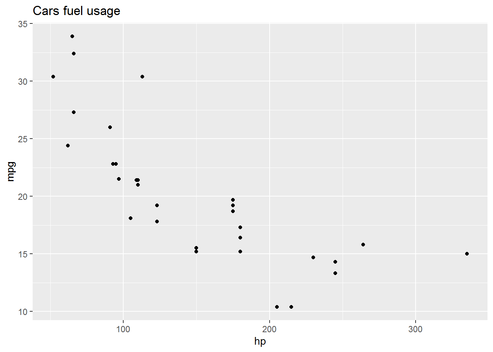
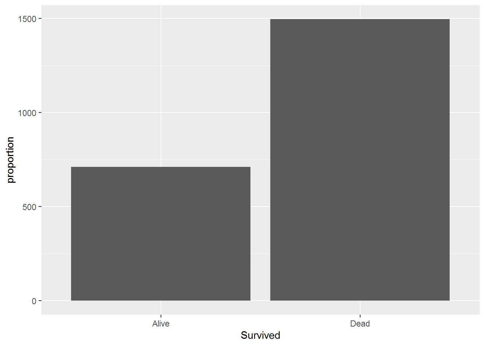
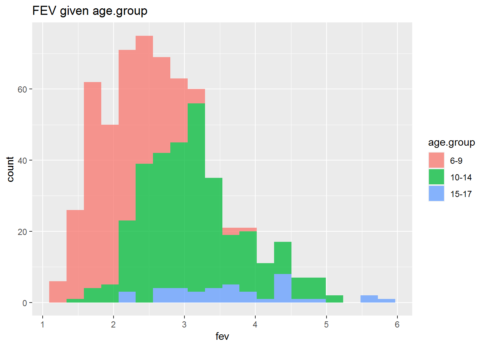

> Den här sidan samlar lite kommandon i den s k **tidyverse** {fig-align="center" width="25"} dialekten av R.

## Introduktion


::: {.cell}

:::


[Tidyverse](https://www.tidyverse.org/) är en samling R-paket som delar på samma underliggande filosofi. När man väl lärt sig Tidyverse-filosofin, är paketen väldigt kraftfulla. Men eftersom det tar sin tid att lära sig Tidyverse så använder vi inte dessa paket på den här grundkursen. För att stilla nyfikenheten bland programmeringintresserade studenter kommer vi då och då länka till motsvarande kod i Tidyverse genom att visa den här ikonen i marginalen:

{fig-align="center" width="60"}

Klickar man på den ikonen får man se motsvarande kod från ett eller flera av de olika Tidyverse-paketen, t ex

{fig-align="center" width="200"}

Speciellt värt att notera bland dessa paket är [ggplot2](https://ggplot2.tidyverse.org/) som, trots sitt knepiga namn, är ett mycket användbart paket för diagram och visualisering.
Se [ggplot2 cheat sheet](https://posit.co/wp-content/uploads/2022/10/data-visualization-1.pdf) för kommandon.

Den s k `pipe`-operatorn `%>%` gör att Tidyverse-kod byggs upp på annats sätt än standard R. Pipe-operatorn skickar vidare en beräkning eller resultat till funktionen till höger i uttrycket. Ett exempel förklarar det bäst:


::: {.cell}

```{.r .cell-code}
suppressMessages(library(tidyverse))
```

::: {.cell-output .cell-output-stderr}
```
Warning: package 'tidyverse' was built under R version 4.2.2
```
:::

::: {.cell-output .cell-output-stderr}
```
Warning: package 'ggplot2' was built under R version 4.2.2
```
:::

::: {.cell-output .cell-output-stderr}
```
Warning: package 'tibble' was built under R version 4.2.2
```
:::

::: {.cell-output .cell-output-stderr}
```
Warning: package 'tidyr' was built under R version 4.2.2
```
:::

::: {.cell-output .cell-output-stderr}
```
Warning: package 'readr' was built under R version 4.2.2
```
:::

::: {.cell-output .cell-output-stderr}
```
Warning: package 'purrr' was built under R version 4.2.2
```
:::

::: {.cell-output .cell-output-stderr}
```
Warning: package 'dplyr' was built under R version 4.2.2
```
:::

::: {.cell-output .cell-output-stderr}
```
Warning: package 'stringr' was built under R version 4.2.2
```
:::

::: {.cell-output .cell-output-stderr}
```
Warning: package 'forcats' was built under R version 4.2.2
```
:::

```{.r .cell-code}
titanic %>% group_by(Survived)  %>% tally()
```

::: {.cell-output .cell-output-stdout}
```
# A tibble: 2 x 2
  Survived     n
  <chr>    <int>
1 Alive      712
2 Dead      1496
```
:::
:::

 där datamaterialet (dataframe) `titanic` skickas in i funktionen `group_by()` som grupperar data efter variablen Survived. Denna gruppering skickas sen vidare till funktioen `tally()` som gör sammanfattningen till en tabell. 

## Scatter plot


::: {.cell}

```{.r .cell-code}
library(ggplot2)
ggplot(data = mtcars, aes(x = hp, y = mpg)) +
  geom_point() + 
  ggtitle("Cars fuel usage") 
```

::: {.cell-output-display}
{width=672}
:::
:::


## Tabeller


::: {.cell}

```{.r .cell-code}
suppressMessages(library(tidyverse))
titanic %>% dplyr::group_by(Survived) %>% tally()
```

::: {.cell-output .cell-output-stdout}
```
# A tibble: 2 x 2
  Survived     n
  <chr>    <int>
1 Alive      712
2 Dead      1496
```
:::
:::


eller om man vill också ha proportioner

::: {.cell}

```{.r .cell-code}
suppressMessages(library(tidyverse))
titanic %>% 
  dplyr::group_by(Survived)  %>% 
  tally() %>% 
  mutate(freq = prop.table(n))
```

::: {.cell-output .cell-output-stdout}
```
# A tibble: 2 x 3
  Survived     n  freq
  <chr>    <int> <dbl>
1 Alive      712 0.322
2 Dead      1496 0.678
```
:::
:::

där vi skrivit våra pipes `%>%` enligt tidyverse-konventionen med radbryt mellan en lång serie pipes. 

## Stapeldiagram

#### Antal

::: {.cell}

```{.r .cell-code}
library(ggplot2)
titanic %>% 
  group_by(Survived)  %>% 
  tally() %>% 
  ggplot(aes(x = Survived, y = n)) +
  geom_bar(stat = "identity") +
  ylab("proportion")
```

::: {.cell-output-display}
{width=672}
:::
:::


## Histogram per kategori i samma figur

::: {.cell}

```{.r .cell-code}
suppressMessages(library(ggplot2))
load(file = url("https://github.com/StatisticsSU/SDA1/blob/main/datorlab/lab3/FevChildren.RData?raw=true"))
ggplot(FevChildren, aes(x = fev, fill = age.group)) + 
  geom_histogram(alpha =0.75, bins = 20) + ggtitle("FEV given age.group")
```

::: {.cell-output-display}
{width=672}
:::
:::

