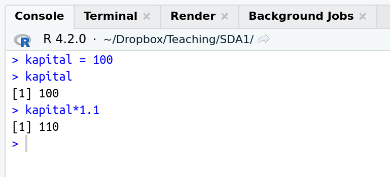
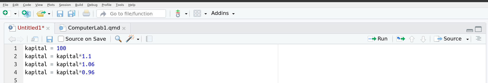
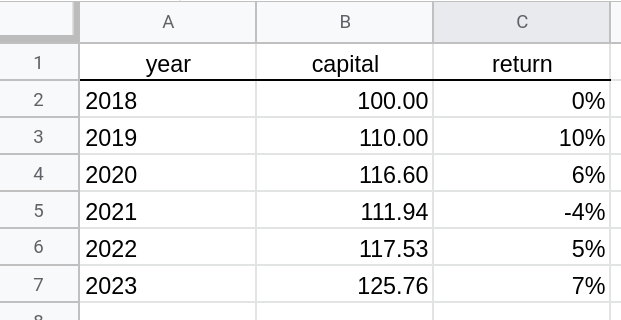

------------------------------------------------------------------------

::: callout-tip
### Instruktioner

💪 Avsnitt med den här symbolen är uppgifter där ni ska göra något.
:::

## 1. Använda R som en miniräknare

Ett bra sätt för att vänja sig vid R är att använda R som en slags miniräknare. I fönstret **Console** i RStudio (nere till vänster vanligtvis) kan man skriva olika typer av **kommandon** som skickas till R för beräkning:

{fig-align="center"}

Tecknet `>` kallas för **kommandoprompt** (eller bara **prompt**) och är R's sätt att tala om att det väntar på att ett nytt kommando ska skrivas in. Vi säger att vi 'skriver något på prompten'.

#### 💪 Uppgift 1.1

Prova att skriva 2+2 efter det nedersta `>` tecknet i **Console** och sedan trycka på `Enter`-tangenten. R bör svara (**returnera**) med talet 4.

#### 💪 Uppgift 1.2

Skriv in talet (2+3)/(2+5) i Console och se att R svarar med 0.7142857.

#### 💪 Uppgift 1.3

Du köper aktier för 100 kr. Avkastningen första året är 10%. Använd R för att beräkna värdet på ditt aktiekapital efter ditt första år som aktiesparare, dvs skriv in 100\*1.1 och se R returnera 110.

## 2. Använda variabler i R

Du är nu inne på ditt andra år som aktiesparare. Avkastningen år 2 är 6%. Hur mycket aktiekapital har du efter år 2? Vi kan beräkna detta genom 100\*1.1\*1.06 i Console och få svaret 116.6 kr. Men finns det något sätt att återanvända vår tidigare beräkning 100\*1.1 = 110 kr så vi bara behöver multiplicera detta tal med ökningen 1.06 för år 2?

Vi kan lösa detta genom att spara undan vår första beräkning i en **variabel**. Vi kan ge denna variabel (nästan) vilket namn vi vill. Jag kommer kalla den för `kapital` och börja med att sätta värdet på variabeln `kapital` till 100, det ursprungliga kapitalet. Vi skriver `kapital = 100` i Console. Vi kan sen testa att R nu faktiskt minns att kapitalet är 100 genom att bara skriva variabelns namn på kommandoprompten i Console:

{fig-align="center" width="400"}

R skriver snällt ut det värde (100) som jag tilldelade variabeln `kapital`.

::: callout-note
Notera språkbruket: vi säger att vi **tilldelar** **variabel** `kapital` **värdet** `100`. Lite mer slarvigt säger vi: 'vi sätter `kapital` till 100'.
:::

::: callout-warning
Vi kan återkalla värdet 100 från variabeln `kapital` när som helst. Men om du stänger ner RStudio och sen startar om programmet (eller om RStudio låser sig) så minns inte R längre värdet på `kapital` . R minns faktiskt inte ens att det fanns något som hette `kapital` och kommer att klaga om du skriver `kapital` på prompten följt av `Enter`. R och RStudio minns bara variabeln inom en **session**, dvs tills du avslutar RStudio. Om man vill spara data mellan olika sessioner måste man spara ner variablerna på datorn hårddisk (eller på någon lagring på internet). Mer om detta senare.
:::

::: callout-note
Istället för att skriva `kapital = 100` så kan vi lika gärna skriva `kapital <- 100` , där symbolen `<-` skrivs med de två tecknen `<` (mindre än) som finns långt ner till vänster på tangentbordet och `-` (bindestreck). Att skriva variabeltilldelningar med `<-` är egentligen den rekommenderade varianten i R, men jag tycker det är fult och föredrar `=`. 🤷
:::

Vi kan nu beräkna kapitalet år 1 genom att multiplicera variabeln `kapital` med talet 1.1

{fig-align="center" width="400"}

Vi kan också **skriva över** värdet i variabeln `kapital` med ett nytt värde. Vi kanske t ex alltid vill att `kapital` ska innehålla värdet på det aktiekapital som jag har just nu. Låt oss först ändra värdet på `kapital` till värdet efter år 1:

{fig-align="center" width="400"}

Notera speciellt raden `kapital = kapital*1.1`. R läser detta som:

> Jag (R) ska plocka fram värdet 100 ur variabeln `kapital`. Sen ska jag multiplicera det med 1.1 för att få talet 110. Det talet 110 stoppar jag sen tillbaka i variabeln `kapital`.

Värdet på variabeln `kapital` är nu alltså 110.

Det fina med det här att vi nu kan fortsätta att ändra variabeln kapital efter att ett ytterligare år har gått, dvs värdet på ditt aktiekapital efter år 2:

{fig-align="center" width="400"}

Variabel `kapital` är nu 116.6 och du är redo för din kommande avkastning under år 3.

#### 💪 Uppgift 2.1

Avkastningen år 3 blev tyvärr minus 4%. Uppdatera variabeln `kapital` ovan så att den visar att värdet på kapitalet efter år 3 är 111.936 kr. Notera att en minskning med 4% innebär att vi måste multiplicera med 0.96 (1-0.04). Multiplikation med tal mindre än 1 leder till en minskning av kapitalet.

## 3. Organisera dig med filmappar

Det är viktigt att ha ordning på sina filer på datorn och kunna tala om för R var dina filer finns så R kan läsa dem. Vi rekommenderar att du skapar en mapp/folder för varje kurs du läser. Spara inte alla filer på datorn skrivbord eller i mappen **Downloads** eller liknande. Gå till filhanteringsprogrammet på din dator och skapa mappen **SDA1**. Så här:

-   {width="15"} Windows: Starta programmet **File Explorer** och klicka på mappen **Documents** (eller **Dokument** om du har svenska som språk). Skapa en ny mapp med namnet **SDA1**.

-   {width="20"}Mac: Starta programmet **Finder** och klicka på mappen **Documents**. Skapa en ny mapp med namnet **SDA1**.

-   {width="20"} Linux: Starta programmet **Nautilus** (om du använder Ubuntu, annars kan du prova att söka på ordet files om din Linux-distribution använder en annan filhanterare). Klicka på mappen **Documents**. Skapa en ny mapp med namnet **SDA1**.

#### 💪 Uppgift 3.1

Skapa mappen **SDA1** i **Documents** på din dator.

## 4. Använda Editorn (Source) för att spara kod

Skriva kommandon direkt i Console har en nackdel: R minns inte kommandona vi har skrivit i en tidigare Session (innan vi stängde ner RStudio). Varje gång vi startar upp RStudio måste vi skriva om våra kommandon om vi vill fortsätta våra beräkningar där vi slutade senast. 😤 (Det är inte riktigt sant, fliken **History** i övre högra delen av RStudio minns faktiskt gamla kommandon, men det är opraktiskt att förlita sig på **History**).

Vi skulle vilja skriva alla våra kommandon i en textfil som vi kan spara på datorns hårddisk och sen bara köra om alla kommandon in en senare Session. Source **Editorn** in övre vänstra delen av RStudio används för just detta.

Om vi klickar på menyn [**F**]{.underline}**ile** och sen under menyn [**N**]{.underline}**ew File** och slutligen på [**R**]{.underline} **Script** så öppnas en tom textfil i **Editorn** som heter *Untitled1* eller något liknande. Här kan vi skriva in kommandon som vi vill spara för framtida sessioner. Vi kan t ex skriva in våra beräkningar av aktiesparandet:



Vi kan spara filen genom att klicka på menyn [**F**]{.underline}**ile** och sen på [**S**]{.underline}**ave** och sen navigera dig till mappen **SDA1** genom att klicka i rutan som kommer upp. Döp filen till **stock** eller något annat namn som talar om vad filen innehåller (aktie heter stock på engelska). Klicka på Save/Spara. Filen kommer automatiskt att få filändelsen .R, dvs filen kommer alltså heta **stock.R** så RStudio vet att det är en fil men R kommandon. Ett samling kommandon kallas också för **kod** och vi säger att vi arbetar med en **kodfil** i editorn.

Vi kan köra alla kommandon i filen stock.R genom att klicka `Source` - knappen uppe i högra hörnet av editorn:

{fig-align="center" width="400"}

Vi ser de körda kommandona i Console och efter att koden har körts kan vi skriva `kapital` i Console för att se svaret 111.936.

När man arbetar med koden vill man ofta köra ett kommando i taget, och inte alla på en gång. Det kan man göra genom att placera markören (det blinkande strecket) på den rad som vill köra (**exekvera**) och sen klicka på `Run`-knappen i uppe i högre hörnet av editorn.

Ofta ställer man markören på den första raden i koden och klickar på `Run`-knappen om och om igen för att köra varje rad, en efter en. Allt som körs, t ex olika variabler som `kapital`, finns tillgängligt i Console, om man t ex vill undersöka om variabeln verkligen har fått det värde som det var meningen att det skulle få.

Man kan också köra flera rader på en gång genom att markera raderna och trycka på `Run`-knappen.

#### 💪 Uppgift 4.1

Kör hela filen stock.R genom att använda `Source`-knappen. Undersök vilket värde variabeln `kapital` i Console har efter att filen körts.

#### 💪 Uppgift 4.2

Kör kommandot på rad 1 i stock.R genom att använda `Run`-knappen. Undersök vilket värde variabeln `kapital` i Console. Upprepa detta för de resterande raderna i stock.R.

## 5. Ställa in arbetsmappen (working directory) i R

Hittills har vi skrivit alla kommandon och tal (t ex `kapital = 100`), dvs vi har matat in **data** själva. Det är naturligtvis klumpigt om man har mycket data. Vi vill kunna läsa in hela **datamaterialet** från en fil. Här är en Excel-fil med data från 5 års investingar i aktier:

{fig-align="center" width="400"}

Notera att:

-   Vi använder engelska namn på kolumnerna. Svenska tecken åäö är bäst att undervika när man skriver kod. Det går att arbeta med åäö i kod, men det är lättast att undvika dem genom att skriva på engelska.

-   Avkastningen (**returns**) anges i procent och är satt till noll under 2018 eftersom vi köpte aktierna precis i början av år 2019 (säger vi) och alltså inte fick någon avkastning under år 2018.\

Excel-filen har jag döpt till stock.xlsx, men den kan döpas till precis vad som helst. Hur kan vi få R att läsa in data från filen stock.xlsx? Det finns två sätt, varav vi endast rekommenderar det första om man är absolut nybörjare. Rätt snart bör du lära dig att använda det andra sättet, som är smidigare i längden.

1.  Spara/flytta filen stock.xlsx till din kurskatalog som du skapade i del 3 ovan, dvs mappen **SDA1** i **Documents**. Ändra din arbetsmapp (**working directory**) i R till samma mapp **SDA1** i **Documents**. **Working directory** är den mapp som R kommer leta efter filer i. Du kan ändra detta genom att välja menyn [**S**]{.underline}**ession** och sen **Set [W]{.underline}orking Directory** och slutligen [**C**]{.underline}**hoose Directory...** och sedan klicka dig fram till mappen SDA1.

{fig-align="center" width="359"}

2.  För att slippa att klicka sig fram via menyer hela tiden så är det praktiskt att ändra working directory i början av den kodfil som man jobbar med. Då kan man bara köra den kodfilen och working directory ställs in automatiskt. Kommandot `setwd` gör samma sak som punkten 1 gjorde via menyerna. Här måste vi dock veta **sökvägen** (**path**) till mappen, dvs datorns sätt att hitta till (under)mappen **SDA1** i **Documents**-mappen. Sättet att skriva sökvägar på skiljer sig åt på Windows/Mac/Linux:
    -   {width="20"} På en Mac skriver vi kommandot: `setwd('/Users/username/Documents/SDA1')` där `username` ska ersättas med ditt användnamn på din Mac (namnet som kommer upp när du loggar in på datorn). Notera de små 'blipparna' kring filvägen i `setwd` kommandot.

    -   {width="20"} På en Linux-dator skriver vi kommandot `setwd('/home/username/Documents/SDA1')` där `username` ska ersättas med ditt användnamn som använder när du loggar in.

    -   {width="15"} På en Windows-dator är det lite krångligare. Sökvägen till (under)mappen **SDA1** i **Documents**-mappen är egentligen C:\\Documents\\SDA1, om du jobbar på hårddisken C:, vilket är vanligast. Dvs Windows använder **backslash**-tecken (**\\**) istället för **slash** (**/**) i filnamn. R är inte jätteförtjust i det och kräver att man skriver en extra backslash för varje slash in sökvägen. Så kommandot för att byta working directory på Windows är `setwd('C:\\Documents\\SDA1')`. Notera de små 'blipparna' kring filvägen i `setwd` kommandot.

#### 💪 Uppgift 5.1

Ställ in din SDA1 mapp som working directory i RStudio. Kontrollera att du lyckades genom att skriva kommandot `getwd()` i Console, som bör skriva ut sökvägen till din SDA1 mapp. Nu har du talat om för R att den ska leta efter filer i din kursmapp **SDA1**!

## 6. Läsa in data från fil

Vi vill nu läsa in data från Excelfilen stock.xlsx. Du kan ladda ner den filen [här](https://github.com/StatisticsSU/SDA1/datorlabb/labb1/aktiespar.xlsx). Beroende på din dator så kommer en av två saker hända:

1.  filen stock.xlsx hamnar automatiskt i mappen **Downloads** (eller liknande) på din dator. Du får då kopiera eller flytta filen till din working directory (din SDA1 mapp) genom att använda dators filhanterare.

2.  du får välja var du vill spara ner filen. Klicka dig fram till din working directory (din SDA1 mapp) och spara filen där.

R kommer nu att hitta filen och vi är redo att skriva kommandot som läser in filen. Eftersom det är första gången du läser in en Excel-fil behöver du göra lite grundjobb. Vi ska göra tre steg:

1.  **Installera R-paketet** `xlsx`. Programmet R kommer med ett antal baskommandon förinstallerat. T ex har vi redan använt **funktionen** `setwd()` för att tala om för R vilken mapp som är vår working directory. Men många kommandon/funktioner i R måste laddas in via s k R-paket. Det finns R-paket för nästan allt man vill göra: läsa in data, gör olika typer av statistiska analyser etc etc. Paketet `xslx` är specialiserat på att läsa in Excel-filer i R. För att installera paketet kör vi kommandot `install.packages('xlsx')` antingen genom att skriv in det i en kodfil och trycka på `Run` eller genom att skriva det direkt i terminalen. Efter det kommer R att skriva ut en massa mumbo-jumbo i Console som beskriver installationen. Via paket kan ta någon minut eller mer för att installera. Om inga fel uppstår brukar installationsmeddelandet avslutas med något liknande:\
    `DONE (xlsx)`\
    `The downloaded source packages are in`\
    följt av någon kryptisk sökväg till stället på din dator där paketet har blivit installerat.\
    \
    Installation av paket behövs bara göras en gång på din dator. Du behöver inte installera om nästa gång du startar upp RStudio på nytt.

2.  Ladda R-paketet `xlsx`. Kommandot `library(xlsx)` laddar funktionerna i paketet xlsx till R's arbetsminne. Först efter denna kommando kan vi använda funktionerna i paketet. Notera att vi behöver 'blippar' kring paketets namn när vi installerar, men inte när vi laddar paketet. Ett paket som laddat in med library finns inte tillgängligt när du start om RStudio. Du måste alltså skriva `library(xlsx)` för varje ny session där du vill läsa in Excel-filer. Det är därför bra att skriva in `library(xlsx)` i kodfilen du ska använda för att läsa in Excel-filer.

3.  Läs in data från Excel-filen genom kommandot/funktionen `read.xlsx()`. Här hela kommandot (**funktionsanropet**):\
    `stockdata = read.xlsx('stock.xlsx', 1, header=TRUE)`\
    Det är några saker att reda ut här. Först, `read.xlsx()` är en **funktion** vilket betyder att det är ett kommando som **gör något** baserat på funktionens **input-argument**:

    -   Det första argumentet `'stock.xlsx'` är en **textsträng** (den har 'blippar') som talar om för `read.xlsx()` *vilken* Excelfil som ska läsas in. Vi behöver inte säga mer eftersom denna fil ligger i vår working directory, som ju R nu känner till.
    -   det andra input-argumentet är en enkel etta, `1`, vilket säger åt `read.xlsx()` att data ligger i det första kalkylbladet i filen stock.xlsx. En Excelfil kan ju har flera kalkylblad, och vill man läsa det andra bladet ändrar man `1` till `2`. (men stock.xlsx har bara ett blad, så prova inte detta för då kommer R att klaga).
    -   det sista argumentet `header=TRUE` talar om för `read.xlsx()` att den första raden i stock.xlsx innehåller namnen på kolumnerna, dvs den första raden är inte data.

    Men vad betyder `stockdata =` i början av kommandot ovan? Jo, om R ska läsa in data till arbetsminnet så måste den ge denna data ett namn, vilket jag har valt till `stockdata` , men du får döpa den till (nästan) vad du vill. `stockdata` är en **variabel**, precis som `kapital` var en variabel tidigare. Variabeln `kapital` var en enkel form av en variabel som bara innehöll ett enda **värde**, t ex 100 i början av vårt sparande. Variabeln `stockdata` är mer komplex. Den innehåller en hel tabell med värden, en s k `dataframe` på R-språk. Så kommandot

    `stockdata = read.xlsx('stock.xlsx', 1, header=TRUE)`

    läses alltså av R som

    > Läs in första kalkylbladet av Excelfilen stock.xlsx till arbetsminnet och hantera första raden som namn/etiketter på kolumnerna. Spara den inlästa tabellen som en dataframe i variabeln `stockdata`.

När man har läst in ett datamaterial är det bra att ta en snabbtitt på den inlästa tabellen för att se att den blev korrekt inläst. Precis som vi gjorde med variabel `kapital` för att se dess värde (t ex 100) så kan skriva `stockdata` i Console för att se dess värde (som ju är en tabell). Om man har en tabell med många rader så blir det fort jobbigt att skriva ut alla rader. Kommandot `head()` är då praktiskt, som bara skriver ut det första 6 raderna av tabellen. Här har vi alla kommandon som krävs för att ladda in data och skriva ut fint på skärmen (förutom `install.packages('xlsx')` som jag antar att du redan har kört för att installera paketet).

```{r}
#| echo: true
library(xlsx)
stockdata = read.xlsx('stock.xlsx', 1, header=TRUE)
head(stockdata)
```

::: callout-tip
Istället för att placera alla filer i din working directory **SDA1** kan man istället ange sökvägen till filen när man läser in den. Om jag t ex har sparat filen i mappen **Downloads** på en Windows-dator så skriver jag **\
**`stockdata = read.xlsx('C:\\Downloads\\stock.xlsx', 1, header=TRUE)`.
:::

#### 💪 Uppgift 6.1

Prova att ladda ner Excelfilen stock.xlsx och spara den i SDA1 mappen. Läs sen in filen i R med kommandot `stockdata = read.xlsx('stock.xlsx', 1, header=TRUE)` . Skriv sen `head(stockdata)` i Console för att titta på data. \
Prova nu att läsa in data med kommandot `stockdata = read.xlsx('stock.xlsx', 1, header=FALSE)` och notera skillnaden genom att återigen skriva `head(stockdata)` i Console.

## 7. Analysera data

När du har läst in datamaterialet i minnet så är det dags att analysera det. Låt oss göra en enkel graf av variabeln `capital` över åren (`year`):

```{r}
plot(capital ~ year, data = stockdata)
```

Här har vi använt funktionen `plot()` med två argument. Argumentet `capital ~ year` talar om för `plot()` att den ska göra en graf ('plotta') variabeln capital på y-axeln och variabeln year på x-axeln. Vi säger att vi 'plottar capital **mot** year'. Men `capital` och `year` är faktiskt inte variabler i Rs arbetsminne. Där finns bara en tabell (dataframe) som heter `stockdata` med kolumner som heter `capital` och `year`. Så vi måste tala om för `plot()` att vi vill hämta variablerna `capital` och `year` från datamaterialet/tabellen/dataframe `stockdata`, vilket är precis vad som händer i det andra argumentet `data = stockdata`. Tecknet **\~** brukar läsa som **tilde** och kan skrivas genom tangenterna `Alt gr` och tangenten till vänster om `Enter`. \
Så kommandot \
\
`plot(capital ~ year, data = stockdata)` \
\
läses av R som

> plotta variabeln `capital` mot variabeln `year`, där både dessa variabler är kolumner i datamaterialet `stockdata`.

Om vi vill beräkna medelvärdet på en variabel kan vi använda funktionen `mean()`. Men om vi vill beräkna medelvärdet av variabeln `capital` med kommandot `mean(capital)` så får vi problemet att R inte har en variabel `capital` i minnet; `capital` är ju bara en kolumn i datamaterialet `stockdata`. Hur säger vi till R: gör om kolumnen `capital` i datamaterialet `stockdata` till en egen variabel och beräkna dess medelvärde (mean på engelska). Lösningen att använda `$`-tecknet för att plocka ut kolumnen `returns` som en egen variabel: `stockdata$capital` och sen använda `mean()` funktionen. Vi kan göra detta på samma kodrad och skriva ut resultatet:

```{r}
meancapital = mean(stockdata$capital)
meancapital
```

Kodraden mean`capital = mean(stockdata$capital)` säger alltså till R att

> Plocka ut kolumnen `capital` från datamaterialet `stockdata` och beräkna dess medelvärde.

Genom att explicit plocka ut kolumner på detta sätt kan vi göra grafen med ett lite annorlunda kommando:

```{r}
plot(stockdata$capital, stockdata$year)
```

där vi inte längre måste använda argumentet `data = stockdata` för att tala om var dessa variabler kommer från. Men det förra kommandot `plot(capital ~ year, data = stockdata)` är nog ändå mer lättläst, tycker jag.

#### 💪 Uppgift 7.1

Läs återigen in data med `stockdata = read.xlsx('stock.xlsx', 1, header=TRUE)`. Gör en graf där du plottar variabeln `returns` mot `year`.
