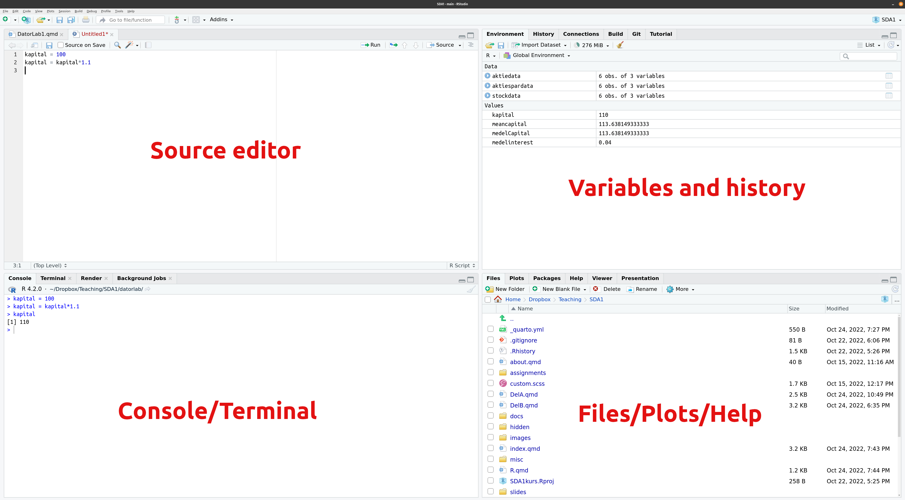
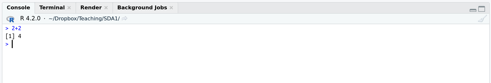
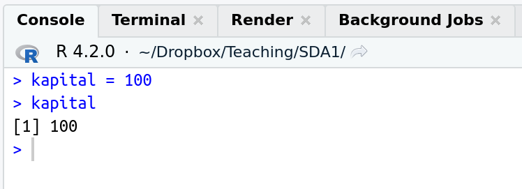
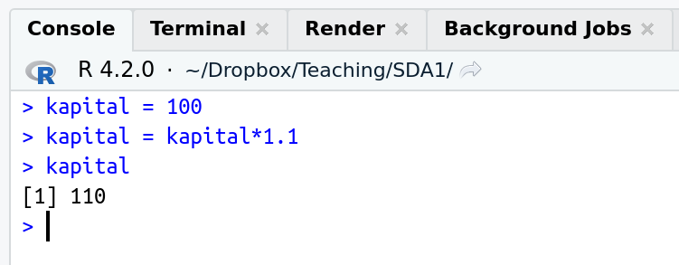
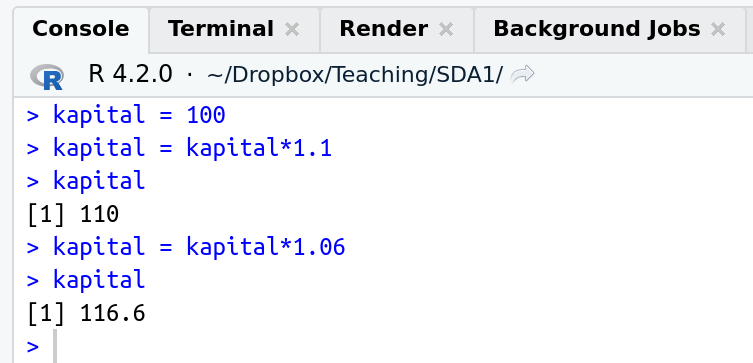
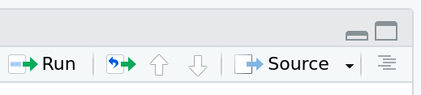
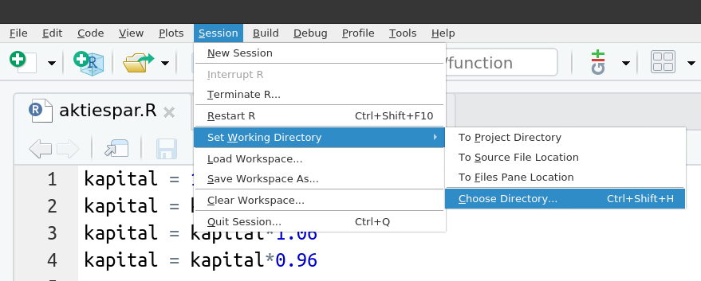
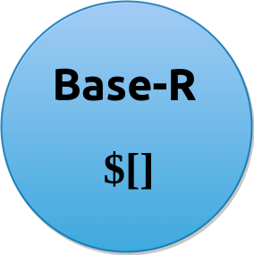

------------------------------------------------------------------------

## Introduktion

> I den här första datorlabben kommer ni bekanta er med programmeringsspråket **R** och dess arbetsmiljö **RStudio**.

::: callout-tip
### Instruktioner

💪 Avsnitt med den här symbolen är uppgifter där ni ska göra något.
:::

::: callout-warning
### Jobba med R på egen dator

Om du inte sitter i en datorsal på Campus måste du först installera R och sen RStudio. Se videon [installera R och Rstudio]() för instruktioner.
:::

För att starta RStudio letar du bara upp programmet på din dator och klickar på startikonen. När RStudio startas upp kommer det att se ut så här (kan se olika ut på olika datorer):



De olika delarna av RStudio kallas ofta för **Panes**. Vi kommer gå igenom dessa delar vartefter, men vi börjar med att utforska **Console**, även kallad **terminalen**.

## 1. Använda R som en miniräknare

Ett bra sätt för att vänja sig vid R är att använda R som en slags miniräknare. I fönstret **Console** i RStudio (vanligtvis nere till vänster) kan man skriva olika typer av **kommandon** som skickas till R för beräkning:

{fig-align="center"}

Tecknet `>` kallas för **kommandoprompt** (eller bara **prompt**) och är R's sätt att tala om att det väntar på att ett nytt kommando ska skrivas in (vid det blinkande strecket). Vi säger att vi 'skriver in något på prompten'.

::: callout-note
## Multiplikation och division

R använder `*` för multiplikation och `/` för division. Potenser (upphöjt till) skrivs med tecknet `^` (`Shift` + tangent till vänster om `Enter`). Så 3\^2 är 9.
:::

#### 💪 Uppgift 1.1

Prova att skriva 2+2 efter det nedersta `>` tecknet i **Console** och sedan trycka på `Enter`-tangenten. R bör svara (**returnera**) med talet 4.

#### 💪 Uppgift 1.2

Skriv in talet (2+3)/(2+5) i Console och se att R svarar med 0.7142857.

#### 💪 Uppgift 1.3

Du köper aktier för 100 kr. Avkastningen första året är 10%. Använd R för att beräkna värdet på ditt aktiekapital efter ditt första år som aktiesparare, dvs skriv in 100\*1.1 och se R returnera 110.

## 2. Använda variabler i R

Du är nu inne på ditt andra år som aktiesparare. Avkastningen år 2 är 6%. Hur mycket aktiekapital har du efter år 2? Vi kan beräkna detta genom 100\*1.1\*1.06 i Console och få svaret 116.6 kr. Men finns det något sätt att återanvända vår tidigare beräkning 100\*1.1 = 110 kr så vi bara behöver multiplicera detta tal med ökningen 1.06 för år 2?

Vi kan lösa detta genom att spara undan vår första beräkning i en **variabel**. Vi kan ge denna variabel (nästan) vilket namn vi vill. Jag kommer kalla den för `kapital` och börjar med att sätta värdet på variabeln `kapital` till 100, det ursprungliga kapitalet. Vi skriver `kapital = 100` i Console. Vi kan sen testa att R nu faktiskt minns att kapitalet är 100 genom att bara skriva variabelns namn följt av `Enter` i kommandoprompten i Console:

{fig-align="center" width="400"}

R skriver snällt ut det värde (100) som jag tilldelade variabeln `kapital`.

::: callout-note
### Språkbruk

vi säger att vi **tilldelar** **variabel** `kapital` **värdet** `100`. Lite mer slarvigt säger vi: 'vi sätter `kapital` till 100'.
:::

::: callout-warning
### Se upp!

Vi kan återkalla värdet 100 från variabeln `kapital` när som helst. Men om du stänger ner RStudio och sen startar om programmet (eller om RStudio låser sig) så minns inte R längre värdet på `kapital` . R minns faktiskt inte ens att det fanns något som hette `kapital` och kommer att klaga om du skriver `kapital` på prompten följt av `Enter`. R och RStudio minns bara variabeln inom en **session**, dvs tills du avslutar RStudio. Om man vill spara data mellan olika sessioner måste man spara ner variablerna på datorns disk (eller på någon lagring på internet). Mer om detta senare.
:::

::: callout-note
Istället för att skriva `kapital = 100` så kan vi lika gärna skriva `kapital <- 100` , där symbolen `<-` skrivs med de två tecknen `<` (mindre än) som finns långt ner till vänster på tangentbordet och `-` (bindestreck). Att skriva variabeltilldelningar med `<-` är egentligen den rekommenderade varianten i R, men jag tycker det är fult och föredrar `=`. 🤷
:::

Vi kan nu beräkna kapitalet år 1 genom att multiplicera variabeln `kapital` med talet 1.1

{fig-align="center"}

Vi kan också **skriva över** värdet i variabeln `kapital` med ett nytt värde. Vi kanske vill att `kapital` alltid ska innehålla värdet på det aktiekapital som jag har just nu. Låt oss först ändra värdet på `kapital` till värdet efter år 1:

{fig-align="center"}

Notera speciellt raden `kapital = kapital*1.1`. R läser detta som:

> Jag (R) ska plocka fram värdet 100 ur variabeln `kapital`. Sen ska jag multiplicera det med 1.1 för att få talet 110. Det talet 110 stoppar jag sen tillbaka i variabeln `kapital`.

Värdet på variabeln `kapital` är nu alltså 110.

Det fina med det här att vi nu kan fortsätta att ändra variabeln kapital efter att ett ytterligare år har gått, dvs värdet på ditt aktiekapital efter år 2:

{fig-align="center" width="400"}

Variabel `kapital` är nu 116.6 och du är redo för din kommande avkastning under år 3.

#### 💪 Uppgift 2.1

Avkastningen år 3 blev tyvärr minus 4%. Uppdatera variabeln `kapital` ovan så att den visar att värdet på kapitalet efter år 3 är 111.936 kr. Notera att en minskning med 4% innebär att vi måste multiplicera med 0.96 (1-0.04). Multiplikation med tal mindre än 1 leder till en minskning av kapitalet.

## 3. Organisera dig med filmappar

Det är viktigt att ha ordning på sina filer på datorn och kunna tala om för R var dina filer finns så R kan läsa dem. Vi rekommenderar att du skapar en mapp/folder för varje kurs du läser. Spara inte alla filer på datorns skrivbord eller i mappen **Downloads** eller liknande. Gå till filhanteringsprogrammet på din dator och skapa mappen **SDA1**. Så här:

-   {width="20"} Windows: Starta programmet **File Explorer** och klicka på mappen **Documents** (eller **Dokument** om du har svenska som språk). Skapa en ny mapp med namnet **SDA1**.

-   {width="20"}Mac: Starta programmet **Finder** och klicka på mappen **Documents**. Skapa en ny mapp med namnet **SDA1**.

-   {width="20"} Linux: Starta programmet **Nautilus** (om du använder Ubuntu, annars kan du prova att söka på ordet files om din Linux-distribution använder en annan filhanterare). Klicka på mappen **Documents**. Skapa en ny mapp med namnet **SDA1**.

::: callout-warning
    Inga åäö!
    Använd inte åäö i namn på filmappar eller filer.
    Stor risk att du får problem då.
:::

#### 💪 Uppgift 3.1

Skapa mappen **SDA1** i **Documents** på din dator.

## 4. Använda Editorn (Source) för att spara kod

Skriva kommandon direkt i Console har en nackdel: R minns inte kommandona vi har skrivit i en tidigare Session (innan vi stängde ner RStudio). Varje gång vi startar upp RStudio måste vi skriva om våra kommandon om vi vill fortsätta våra beräkningar där vi slutade senast. 😤 (Det är inte riktigt sant, fliken **History** i övre högra delen av RStudio minns faktiskt gamla kommandon, men det är opraktiskt att förlita sig på **History**).

Vi skulle vilja skriva alla våra kommandon i en textfil som vi kan spara på datorns hårddisk och sen bara köra om alla kommandon in en senare Session. Source **Editorn** in övre vänstra delen av RStudio används för just detta.

Om vi klickar på menyn [**F**]{.underline}**ile** och sen under menyn [**N**]{.underline}**ew File** och slutligen på [**R**]{.underline} **Script** så öppnas en tom textfil i **Editorn** som heter *Untitled1* eller något liknande. Här kan vi skriva in kommandon som vi vill spara för framtida sessioner. Vi kan t ex skriva in våra beräkningar av aktiesparandet:


Vi kan spara filen genom att klicka på menyn [**F**]{.underline}**ile** och sen på [**S**]{.underline}**ave** och sen navigera dig till mappen **SDA1** genom att klicka i rutan som kommer upp. Döp filen till **stock** eller något annat namn som talar om vad filen innehåller (aktie heter stock på engelska). Klicka på Save/Spara. Filen kommer automatiskt att få filändelsen .R, dvs filen kommer alltså heta **stock.R** så RStudio vet att det är en fil men R kommandon. Ett samling kommandon kallas också för **kod** och vi säger att vi arbetar med en **kodfil** i editorn.

Vi kan köra alla kommandon i filen stock.R genom att klicka på `Source` - knappen uppe i högra hörnet av editorn:

{fig-align="center" width="400"}

Vi ser de körda kommandona i Console och efter att koden har körts kan vi skriva `kapital` i Console för att se svaret 111.936.

När man arbetar med koden vill man ofta köra ett kommando i taget, och inte alla på en gång. Det kan man göra genom att placera markören (det blinkande strecket) på den rad som vill köra (**exekvera**) och sen klicka på `Run`-knappen i uppe i högre hörnet av editorn.

Ofta ställer man markören på den första raden i koden och klickar på `Run`-knappen om och om igen för att köra varje rad, en efter en. Allt som körs, t ex olika variabler som `kapital`, finns tillgängligt i Console, om man t ex vill undersöka om variabeln verkligen har fått det värde som det var meningen att det skulle få.

Man kan också köra flera rader på en gång genom att markera raderna och trycka på `Run`-knappen.

#### 💪 Uppgift 4.1

Kör hela filen stock.R genom att använda `Source`-knappen. Undersök vilket värde variabeln `kapital` i Console har efter att filen körts.

#### 💪 Uppgift 4.2

Kör kommandot på rad 1 i stock.R genom att använda `Run`-knappen. Undersök vilket värde variabeln `kapital` i Console. Upprepa detta för de resterande raderna i stock.R.

## 5. Ställa in arbetsmappen (working directory) i R

Hittills har vi skrivit alla kommandon och tal (t ex `kapital = 100`), dvs vi har matat in **data** själva. Det är naturligtvis klumpigt om man har mycket data. Vi vill kunna läsa in hela **datamaterialet** från en fil. Här är en Excel-fil med data från 5 års investingar i aktier:

{fig-align="center" width="400"}

Notera att:

-   Vi använder engelska namn på kolumnerna. Svenska tecken åäö är bäst att undervika när man skriver kod. Det går att arbeta med åäö i kod, men det är lättast att undvika dem genom att skriva på engelska. Du kan inte använda mellanslag (space) i variabelnamn. Ofta vill man ha ett variabelnamn som är lätt att förstå vad variabeln innehåller. Använd `_` (underscore) eller `.` (punkt) för att dela upp ord om det behövs. T ex `my_pretty_little_variable = 100`.

-   Avkastningen (**returns**) anges i procent och är satt till noll under 2018 eftersom vi köpte aktierna precis i början av år 2019 (säger vi) och alltså inte fick någon avkastning under år 2018.\

Excel-filen har jag döpt till *stock.xlsx*, men den kan döpas till precis vad som helst.

Om R ska kunna läsa in data från filen stock.xlsx så måste vi tala om *var* filen finns på vår dator. Enklast är då att ställa in Rs **working directory**, dvs det standardställe där R letar efter filer i den pågående sessionen. Det finns två sätt att göra detta, varav vi endast rekommenderar det första om man är absolut nybörjare. Rätt snart bör du lära dig att använda det andra sättet, som är smidigare i längden.

1.  **Working directory** är den mapp som R kommer leta efter filer i. Ändra din arbetsmapp (**working directory**) i R till samma mapp **SDA1** i **Documents** genom att välja menyn [**S**]{.underline}**ession** och sen **Set [W]{.underline}orking Directory** och slutligen [**C**]{.underline}**hoose Directory...** och sedan klicka dig fram till mappen SDA1.

{fig-align="center" width="359"}

2.  För att slippa att klicka sig fram via menyer hela tiden så är det praktiskt att ändra working directory i början av den kodfil som man jobbar med. Då kan man bara köra den kodfilen och working directory ställs in automatiskt. Kommandot `setwd` gör samma sak som punkten 1 gjorde via menyerna. Här måste vi dock veta **sökvägen** (**path**) till mappen, dvs datorns sätt att hitta till (under)mappen **SDA1** i **Documents**-mappen. Sättet att skriva sökvägar på skiljer sig åt på Windows/Mac/Linux:
    -   {width="20"} På en Mac skriver vi kommandot: `setwd('/Users/username/Documents/SDA1')` där `username` ska ersättas med ditt användnamn på din Mac (namnet som kommer upp när du loggar in på datorn). Notera de små 'blipparna' kring filvägen i `setwd` kommandot.

    -   {width="15"} På en Windows-dator skriver vi kommandot `setwd('C:/Documents/SDA1')`. Notera de små 'blipparna' kring filvägen i `setwd` kommandot. \[Windows-sökvägar skrivs vanligtvis med backslash `\`. I RStudio skriver man ändå `/` för att matcha med Mac och Linux\].

    -   {width="20"} På en Linux-dator skriver vi kommandot `setwd('/home/username/Documents/SDA1')` där `username` ska ersättas med ditt användnamn som använder när du loggar in.

#### 💪 Uppgift 5.1

Ställ in din **SDA1** mapp som working directory i RStudio. Kontrollera att du lyckades genom att skriva kommandot `getwd()` i Console, som bör skriva ut sökvägen till din SDA1 mapp. Nu har du talat om för R att den ska leta efter filer i din kursmapp **SDA1**!

## 6. Läsa in data från fil

Vi vill nu läsa in data från Excelfilen stock.xlsx. Du kan ladda ner den filen [här](https://github.com/StatisticsSU/SDA1/datorlabb/lab1/stock.xlsx). Beroende på din dator så kommer en av två saker hända:

1.  filen stock.xlsx hamnar automatiskt i mappen **Downloads** (eller liknande) på din dator. Du får då kopiera eller flytta filen till din working directory (din SDA1 mapp) genom att använda datorns filhanterare.

2.  du får välja var du vill spara ner filen. Klicka dig fram till din working directory (din SDA1 mapp) och spara filen där.

R kommer nu att hitta filen och vi är redo att skriva kommandot som läser in filen. Eftersom det är första gången du läser in en Excel-fil behöver du göra lite grundjobb. Vi ska göra tre steg:

1.  **Installera R-paketet** `readxl`. Programmet R kommer med ett antal baskommandon förinstallerat. T ex har vi redan använt **funktionen** `setwd()` för att tala om för R vilken mapp som är vår working directory. Men många kommandon/funktioner i R måste laddas in via s k **R-paket**. Det finns R-paket för nästan allt man vill göra: läsa in data, gör olika typer av statistiska analyser etc etc. Paketet `readxl` är specialiserat på att läsa in Excel-filer i R. För att installera paketet kör vi kommandot `install.packages('readxl')` antingen genom att skriv in det i en kodfil och trycka på `Run` eller genom att skriva det direkt i terminalen. Efter det kommer R att skriva ut en massa mumbo-jumbo i Console som beskriver installationen. Paket kan ta någon minut eller mer för att installera. Om inga fel uppstår brukar installationsmeddelandet avslutas med något liknande:\
    `DONE (readxl)`\
    `The downloaded source packages are in`\
    följt av någon kryptisk sökväg till stället på din dator där paketet har blivit installerat.\
    \
    Installation av paket behövs bara göras en gång på din dator. Du behöver inte installera om nästa gång du startar upp RStudio på nytt.

2.  **Ladda R-paketet** `readxl`. Kommandot `library(readxl)` laddar funktionerna i paketet `readxl` till R's arbetsminne. Först efter denna kommando kan vi använda funktionerna i paketet. Notera att vi behöver 'blippar' kring paketets namn när vi installerar, men inte när vi laddar paketet. Ett paket som laddat in med library finns inte tillgängligt när du start om RStudio. Du måste alltså skriva `library(readxl)` för varje ny session där du vill läsa in Excel-filer. Det är därför bra att skriva in `library(readxl)` i kodfilen du ska använda för att läsa in Excel-filer.

3.  Läs in data från Excel-filen genom kommandot/**funktionen** `read_excel()`. Här hela kommandot (**funktionsanropet**):\
    `stockdata = read_excel('stock.xlsx', sheet = 1)`\
    Det är några saker att reda ut här. Först, `read_excel()` är en **funktion** vilket betyder att det är ett kommando som **gör något** baserat på funktionens **input-argument**:

    -   Det första argumentet `'stock.xlsx'` är en **textsträng** (den har 'blippar') som talar om för `read_excel()` *vilken* Excelfil som ska läsas in. Vi behöver inte säga mer eftersom denna fil ligger i vår working directory, som ju R nu känner till.
    -   det andra input-argumentet är `sheet = 1`, vilket säger åt `read_excel()` att data ligger i det första kalkylbladet i filen stock.xlsx. En Excelfil kan ju har flera kalkylblad, och vill man läsa det andra bladet ändrar man `1` till `2`. (men stock.xlsx har bara ett blad, så prova inte detta för då kommer R att klaga).

    Men vad betyder `stockdata =` i början av kommandot ovan? Jo, om R ska läsa in data till arbetsminnet så måste den ge denna data ett namn, vilket jag har valt till `stockdata` , men du får döpa den till (nästan) vad du vill. `stockdata` är en **variabel**, precis som `kapital` var en variabel tidigare. Variabeln `kapital` var en enkel form av en variabel som bara innehöll ett enda **värde**, t ex 100 i början av vårt sparande. Variabeln `stockdata` är mer komplex. Den innehåller en hel tabell med värden. Så kommandot

    `stockdata = read_excel('stock.xlsx', sheet = 1)`

    läses alltså av R som

    > Läs in första kalkylbladet av Excelfilen stock.xlsx till arbetsminnet och spara den inlästa tabellen som en tabell i variabeln `stockdata`.

R har lite olika varianter av tabellvariabler. Den viktigaste för oss på den här kursen är en s k `dataframe`. Funktionen `read_excel()` läser dock in data som en s k `tibble`-tabell. För att göra om en `stockdata` till en dataframe skriver vi kommandot `stockdata = data.frame(stockdata)`, där variabeln (tabellen) `stockdata` skrivs över med resultatet att stockdata nu är en `dataframe`.

När man har läst in ett datamaterial är det bra att ta en snabbtitt på den inlästa tabellen för att se att den blev korrekt inläst. Precis som vi gjorde med variabel `kapital` för att se dess värde (t ex 100) så kan skriva `stockdata` i Console för att se dess värde (som ju är en tabell). Om man har en tabell med många rader så blir det fort jobbigt att skriva ut alla rader. Kommandot `head()` är då praktiskt, som bara skriver ut det första 6 raderna av tabellen. Här har vi alla kommandon som krävs för att ladda in data och skriva ut fint på skärmen (förutom `install.packages('readxl')` som jag antar att du redan har kört för att installera paketet).

```{r}
#| echo: true
library(readxl)
stockdata = read_excel('stock.xlsx', sheet = 1)
stockdata = data.frame(stockdata) # gör om stockdata till en dataframe
head(stockdata)
```

::: callout-tip
Istället för att placera alla filer i din working directory **SDA1** kan man istället ange sökvägen till filen när man läser in den. Om jag t ex har sparat filen i mappen **Downloads** på en Windows-dator så skriver jag **\
**`stockdata = read.xlsx('C:/Downloads/stock.xlsx', 1, header=TRUE)`.
:::

#### 💪 Uppgift 6.1

Prova att ladda ner Excelfilen stock.xlsx och spara den i SDA1 mappen. Läs sen in filen i R med kommandot `stockdata = read.xlsx('stock.xlsx', 1, header=TRUE)` . Skriv sen `head(stockdata)` i Console för att titta på data.\
Prova nu att läsa in data med kommandot `stockdata = read.xlsx('stock.xlsx', 1, header=FALSE)` och notera skillnaden genom att återigen skriva `head(stockdata)` i Console.

#### 💪 Uppgift 6.2

Ändra värdet på variabeln `returns` år 2023 till 0.05 i stockdata tabellen genom att skriva `stockdata[6,3] = 0.05` i Console. Det här kommandot läser R som:

> Värdet i tabellen `stockdata` på rad 6 och kolumn 3 ska ändras till (tilldelas) värdet 0.05.

Prova att skriva `stockdata` i Console för att kontrollera att värdet faktiskt ändrades.

#### 💪 Uppgift 6.3

Spara den ändrade stockdata-tabellen till disk genom att skriva följande kommando i Console:

```{r}
save(stockdata, file="stockdata2.Rdata")
```

vilket sparar den ändrade `stockdata` tabellen till filen `stockdata2.Rdata` i din working directory (**SDA1**-mappen). Filformatet `Rdata` är R's eget filformat. Du kan i en senare session läsa in stockdata enkelt genom kommandot

```{r}
load("stockdata2.Rdata")
```

vilket kommer läsa in tabellen `stockdata` i R's arbetsminne.

## 7. Analysera data

När du har läst in datamaterialet i minnet så är det dags att analysera det. Låt oss göra en enkel graf av variabeln `capital` över åren (`year`):

```{r}
plot(capital ~ year, data = stockdata)
```

Här har vi använt funktionen `plot()` med två argument. Argumentet `capital ~ year` talar om för `plot()` att den ska göra en graf ('plotta') variabeln capital på y-axeln och variabeln year på x-axeln. Vi säger att vi 'plottar capital **mot** year'. Men `capital` och `year` är faktiskt inte variabler i Rs arbetsminne. Där finns bara en tabell (dataframe) som heter `stockdata` med kolumner som heter `capital` och `year`. Så vi måste tala om för `plot()` att vi vill hämta variablerna `capital` och `year` från datamaterialet/tabellen/dataframe `stockdata`, vilket är precis vad som händer i det andra argumentet `data = stockdata`. Tecknet **\~** brukar läsa som **tilde** och kan skrivas genom tangenterna `Alt gr` och tangenten till vänster om `Enter`.\
Så kommandot\
\
`plot(capital ~ year, data = stockdata)`\
\
läses av R som

> plotta variabeln `capital` mot variabeln `year`, där både dessa variabler är kolumner i datamaterialet `stockdata`.

Om vi vill beräkna medelvärdet på en variabel kan vi använda funktionen `mean()`. Men om vi vill beräkna medelvärdet av variabeln `capital` med kommandot `mean(capital)` så får vi problemet att R inte har en variabel `capital` i minnet; `capital` är ju bara en kolumn i datamaterialet `stockdata`. Hur säger vi till R: gör om kolumnen `capital` i datamaterialet `stockdata` till en egen variabel och beräkna dess medelvärde (mean på engelska). Lösningen att använda `$`-tecknet för att plocka ut kolumnen `returns` som en egen variabel: `stockdata$capital` och sen använda `mean()` funktionen. Vi kan göra detta på samma kodrad och skriva ut resultatet:

```{r}
meancapital = mean(stockdata$capital)
meancapital
```

Kodraden mean`capital = mean(stockdata$capital)` säger alltså till R att

> Plocka ut kolumnen `capital` från datamaterialet `stockdata` och beräkna dess medelvärde.

Genom att explicit plocka ut kolumner på detta sätt kan vi göra grafen med ett lite annorlunda kommando:

```{r}
plot(stockdata$capital, stockdata$year)
```

där vi inte längre måste använda argumentet `data = stockdata` för att tala om var dessa variabler kommer från. Men det förra kommandot `plot(capital ~ year, data = stockdata)` är nog ändå mer lättläst, tycker jag.

#### 💪 Uppgift 7.1

Läs återigen in data med `stockdata = read_excel('stock.xlsx', sheet = 1)`. Gör en graf där du plottar variabeln `returns` mot `year`.

Här är hela koden i ett stycke:

```{r}
#| echo: true
setwd('/home/mv/Dropbox/Teaching/SDA1/datorlab/lab1') # I have a Linux computer and my data is in this path
library(readxl)                         
stockdata = read_excel('stock.xlsx', sheet = 1)
stockdata = data.frame(stockdata)
meancapital = mean(stockdata$capital)
plot(capital ~ year, data = stockdata)
```

Notera att vi kan skriva **kommentarer** i koden genom tecknet `#` innan kommentaren. Allt efter tecknet `#` ignoreras av R när den läser koden. Det kan vara ett bra sätt att förklara en kodrad för användaren.

## 8. Några extra tips

-   Om du trycker på 'pil-upp' ⍐ tangenten i Console så kan du stega dig tillbaka till **gamla kommandon** som du har skrivit.
-   Om du vill **städa upp i Console** kan du skriva `Ctrl + l` för att rensa Console från text (dvs ett litet L). Dina variabler blir kvar i arbetsminnet.
-   **History**-fliken uppe till höger i RStudio visar alla tidigare kommandon.
-   **Environment**-filken uppe till höger i RStudio ger dig information om de datamaterial och variabler som R har i arbetsminnet. Prova genom att definiera en ny variabel `c=100` i Console och hur den dyker upp i **Environment**-fliken. Prova att klicka på den blå pilen framför stockdata, du kommer se kolumnerna i det datamaterialet.
-   **Files**-fliken nere till höger i RStudio är en inbyggd filhanterare. Den visar filerna i ditt working directory och du kan även hantera filer där (ta bort, döpa om osv).
-   I **Help**-fliken kan du söka på hjälp på olika kommandon. Prova att skriva in `mean`. Du kan även få hjälp genom att skriva t ex `?mean` i Console.

## 9. Datastrukturer

R kan spara data i olika **datastrukturer**. Vi definerade tidigare variabeln `kapital` och tilldela denna variabel värdet `100` genom kommandot `kapital = 100`.

Ofta vill man spara mer än ett tal i samma datastruktur. Ett sätt är att skapa en **vektor** med kommandot `c()`

```{r}
capital_all_years = c(100,110,116.6,111.936,117.532,125.760)
```

Den nya variabel `capital_all_years` innehåller alltså kapitalet för alla år. Men om jag skulle vilja 'plocka ut' kapitalets värde vid det tredje året? Då kan man indexera vektorn genom hakparenteser (brackets) `[]`, så här:

```{r}
capital_all_years[3]
```

Man kan också plocka ut flera värden samtidigt, t ex år 3 och 5, med kommandot

```{r}
capital_all_years[c(3,5)]
```

Notera att vi indexerade med en vektor, dvs vi använde `c()` kommandot eftersom vi vill tala om för R att plocka ut fler än ett värde.

Vi har redan sett en av Rs viktigaste datatyper: en s k **dataframe**. En dataframe är en tabell med information om vad kolumnerna heter, och ibland även vad raderna heter. Ett exempel är vår `stockdata` som är dataframe med tre kolumner: year, capital och stock. Vi kan se att det är en dataframe genom att använda kommandot `class()`:

```{r}
class(stockdata)
```

Vi har faktiskt redan använt idéen med att plocka ut värden genom indexing in dataframes tidigare när vi skrev `stockdata[6,3]` för att plocka ut värdet på rad 6 och kolumn 3 i tabellen/dataframe. Och vi såg att vi också kunde ändra värdena i tabellen genom tilldelning: `stockdata[6,3]=0.05` . Samma sak kan man göra med en vektor, t ex så gör kommandot `capital_all_years[5] = 200` att vi ändrar kapitalet år 5 till 200 i vår vektor som innehåller alla års kapital.

Det finns en annan slags tabell som kan vara bra att känna till i R, en s k **matris** (eng. Matrix). Matriser är som dataframes, men innehåller inte information om namnet på kolumnerna. Å andra sidan kan man göra matematiska beräkningar med hela matriser, men det är inget vi gör på denna kurs. Anledningen till att vi nämner matriser här är att man ibland måste göra om en matris till en dataframe eller tvärtom. Vissa R-program vi bara jobba med dataframes och klagar om man försöker få det att jobba med en matris. Låt oss skapa en matris som jag kallar `A` :

```{r}
A = matrix(c(11,2,4,5,62,3), 3, 2)
A
```

vilket är en matris (tabell) med 3 rader och 2 kolumner (som vi skapar från en vektor med 6 tal). Om vi använder `class()`-kommandot så ser vi att A mycket riktigt är en matrix, vilket är engelska för matris:

```{r}
class(A)
```

Om vi vill göra om en matris till en dataframe så använder vi kommandot

```{r}
B = as.data.frame(A)
B
```

där R bestämmer att kolumnerna ska heta V1 och V2 (en dataframe måste ha namn på kolumnerna i tabellen). B är alltså nu en dataframe, vilket man kan testa genom:

```{r}
class(B)
```

En annan viktigt datatyp vi vill nämna är en s k **sträng** (eng. string), vilket kallas för `character` i R och är en variabel som innehåller text. Värdet på en sträng-variabel skriv innanför citattecken:

```{r}
mittnamn = "mattias"
class(mittnamn)
```

Man kan även använda enkla 'blippar' kring strängens värde, dvs `mittnamn = 'mattias'`.

Om vi t ex använder `names()` kommandot på vår `stockdata` dataframe så får vi en vektor med strängar (en vektor eftersom det finns fler än ett kolumnnamn i `stockdata`):

```{r}
names(stockdata)
```

Slutligen finns datatypen `list` i R. En list (eller lista på svenska) är en vektor på steroider. En vanlig vektor måste innehålla *data av samma sort*, t ex en vektor med numeriska tal `x = c(1,4,5)` eller en vektor med strängar (text): `c("mattias","adam","elma")` . En lista är mer generell och kan innehålla data av olika sort:

```{r}
my_list = list(a = 2, b = "hej", d = c(4,5,2))
my_list
```

Jag kan döpa elementen i listan vad jag vill, här kallade jag dem `a`, `b` och `d` (jag vill undvika bokstaven c eftersom det är symbolen för att skapa vektorer). Notera att elementet `a` innehåller ett enda tal, `b` en sträng och `d` en vektor med tre tal. I utskriften ser man också att det olika listelementen med ett \$-tecken framför. För att t ex plocka ut listelementet `d` kan man nämligen skriva

```{r}
my_list$d
```

Känns det bekant med \$-tecken för att plocka ut saker? Vi har redan sett att man kan plocka ut en kolumn i en dataframe (tabell) genom att skriva t ex `stockdata$returns` . En dataframe är nämligen egentligen en slags lista.

::: callout-tip
Du kan skriva `my_list` i Console och sedan trycka på `tab`-tangenten i övre vänstra hörnet av tangentbordet för att se alla element som finns i listan `my_list`. Klicka på det element du vill visa. 🤩
:::

I nästa datorlab kommer vi introducera ännu en viktig datatyp i R: `factor`. Men låt oss spara något till dess.

## 10. Funktioner

Vi har sett idén med funktioner tidigare: en funktion *gör* något med data. I matematikens värld är en funktion $f$ en slags maskin som använder en **input** $x$, gör några matematiska beräkningar, och ger tillbaka en **output** $y$. Vi brukar skriva funktionen som $y=f(x)$.

En funktion i R är en liknande sak: den använder ett eller flera inputs och ger tillbaka ett eller flera outputs. Det kan handla om ren matematisk funktion, som kvadratroten $\sqrt{x}$ av ett tal $x$, vilket i R beräknas av funktionen `sqrt`:

```{r}
x = 4
y = sqrt(x)
y
```

men det kan också vara något mer komplicerat som t ex att läsa in data från en Excel-fil:

```{r}
stockdata = read_excel('stock.xlsx', sheet = 1)
```

där `read_excel` är en funktion som tre input-argument filnamn (som en sträng!), talet 1 för att vi vill läsa det första bladet. Funktionen `read_excel` ger tillbaka en (tibble) dataframe som output med data.

Det fina med programmeringsspråk är att man kan **skapa egna funktioner** som gör just det jobb som man behöver. Om jag t ex vill skapa en funktion som beräknar ränta-på-ränta effekten på ett sparkapital (med samma ränta varje år) så kan jag skriva ihop följande funktion:

```{r}
capital_interest <- function(capital, interest, years){
  newcapital = capital*interest^years
  return(newcapital)
}
```

Några saker att notera:

-   Man använder alltid ordet `function` där att definiera en funktion.

-   Funktionens input-argument skrivs inom parenteser. Vilka namn du väljer är helt fritt, men det måste vara samma variabelnamn som du sedan använder innanför de s k måsvingarna `{}` som innehåller den faktiska koden som gör jobbet.

-   Funktionen tilldelas en variabel som jag gett namnet `capital_interest` , vilket är ett namn du väljer helt själv.

-   Koden använder ränta-på-ränta formeln $capital\cdot interest^{years}$ , dvs räntan, angett som 1.1 om du får 10% ränta, upphöjs i antal sparandeår. Upphöjt skrivs som `^` i R.

-   Funktionen avslutar med ordet `return` och den variabel du vill att funktionen ska ge tillbaka som output.

Om jag sen vill använda min funktion för att se hur min hundring på banken kommer att utvecklas under 20 år med 5% ränta så skriver jag (jag **anropar** funktionen):

```{r}
my_money = capital_interest(100, 1.05, 20)
my_money
```

Vi sa ovan att vi tilldelade variabeln `capital_interest` en funktion. 🤯 Wait, what? Jo, faktiskt, om vi undersöker vilken typ av variabel `capital_interest` är så är det faktiskt en funktion:

```{r}
class(capital_interest)
```

När vi skrev variabel `kapital` i Console skrev den ut värdet, t ex 100. Vad händer om vi göra samma sak med vår funktionsvariabel `capital_interest` ? Hela funktionen skrivs ut som text!

```{r}
 capital_interest 
```

Vi kommer inte att skriva egna funktioner på kursen. Men du kommer att använda funktioner. Och då kan det vara bra att veta att någon har skrivit dessa funktioner på precis det sätt som vi skapade funktionen `capital_interest` ovan.

En sista sak: vissa funktioner har inga inputargument och ibland inte heller några outputs. Det betyder inte att funktionen inte gör något, utan den har istället vissa sido-effekter som inte alltid syns. `setwd` är t ex funktion som har sökvägen som input, men har inga output, men däremot sidoeffekten att ändra working directory. Funktionen `getwd()` har inga input-argument men ger tillbaka din nuvarande working directory som output.

## 11. Tre dialekter av R

Man kan dela upp R's språk i tre slags dialekter, dvs tre olika kommandon (syntax) för att göra ungefär samma sak:

-   **Base-R** - den ursprungliga syntaxen in R
-   **Formula syntax** - syntax som via paketet `Mosaic` har utvecklats undervisning i statistik
-   **Tidyverse** - en modern syntax utvecklat av personerna bakom RStudio.

I SDA1 kommer vi försöka använda Formula syntax som mycket som möjligt, med inslag av Base-R. Tidyverse-kod kan ofta vara extremt effektiv, men tar för lång tid att lära sig på en grundkurs i statistik. Vi kommer dock då och då att visa hur man gör samma sak i de olika dialekterna, men på ett sätt som inte stör flödet för den student som helst vill hålla sig till ett sätt. Vi använder ikoner som du som student kan klicka på för att se ett kommando i olika dialekter. Här är ett exempel (prova att klicka ikonerna i höger-marginalen):

I Formula syntax har vi redan sett att vi kan göra en scatter plot med kommandot

```{r}
plot(mpg ~ hp, data = mtcars, main = "Cars fuel usage")
```

::: column-margin
[{width="47" height="48"}](../../R/BaseRSyntax.qmd#scatter-plot) [{width="47" height="48"}](../../R/TidyverseSyntax.qmd#scatter-plot)
:::

Om man vill ha plottar som liknar de fina plottarna i Tidyverse, men fortsätta att skriva den enklare formula-syntaxen så kan man använda paketet `ggformula`:

```{r}
#| message: false
library(ggformula)
gf_point(mpg ~ hp, data = mtcars, title = "Cars fuel usage")
```

## 12. Sammanfattning

I den här datorlaborationen har du lärt dig att:

-   Använda R som en miniräknare.

-   Använda variabler som ett sätt att spara värden i en session.

-   Sätta working directory så R kan hitta dina filer.

-   Skriva kod både i Console och Editorn.

-   Läsa in data från fil och göra inledande grafer och medelvärdeberäkningar för dataanalys.
