::: callout-warning
Den här labben förutsätter att följande paket finns installerade:

-   `mosaic`

-   `corrplot`

Paket kan installeras via kommandot `install.packages('packagename')`, där `'packagename'` är namnet på paketet, t.ex `'mosaic'`.
:::

## Introduktion

> I den här datorlabben kommer vi att beskriva samband mellan två numeriska variabler via punktdiagram och korrelation. Vi kommer också att modellera samband via både enkel och multiple linjär regression och lära oss tolka resultaten samt modellvalidering. Vi kommer att lära oss prediktion i linjär regression och hur man kan genomföra modellval genom korsvalidering. När data inte uppvisar ett linjärt samband ska vi lära oss hur man kan transformera data och anpassa en icke-linjär regression. Icke-linjär regression är svårare att tolka, men har klart bättre prediktionsförmåga om det finns icke-linjära samband mellan variabler. För de studenterna som är intresserade så finns det ett extra avsnitt som dyker lite djupare i R.

#### 💪 Uppgift 0.1

Se till att paketen ovan är installerade innan du fortsätter med resten.

#### 💪 Uppgift 0.2

Skapa en mapp `Lab4` i din kursmapp SDA1 (såsom ni gjorde i Lab 1). Ladda ner Quarto-filen för denna lab genom att högerklicka [här](https://github.com/StatisticsSU/SDA1/raw/main/datorlab/lab4/DatorLab4.qmd) och välj 'Spara länk' eller något likande från menyn som dyker upp. Spara filen i din nya `Lab4` mapp. Öppna Quarto-filen i RStudio. Du kan nu fortsätta med denna laboration direkt i Quarto-dokumentet, där du också fyller i svaren på dina laborationsövningar. Du kan alltså lämna den här webbsidan nu och fortsätta arbetet i RStudio.

Väl inne i RStudio med öppnat Quarto-dokument i 'Editor' kan ni gå över till 'Source mode' genom att klicka på 'Source' i det vänstra hörnet av din 'Editor'. Source mode är detaljerat och bra att skriva kod i eftersom man har full kontroll på dokumentet, men det är svårt att få en översikt av dokumentet. Prova nu att gå över till 'Visual mode' genom att klicka på 'Visual' i det vänstra hörnet av din 'Editor'. Vi rekommenderar att ni mestadels arbetar i Visual mode, men att gå över till Source mode när man verkligen vill få till någon detalj som är svår att ändra i Visual mode. ´

#### 💪 Uppgift 0.3

Klicka på knappen Render i Editor-fönstret för att **kompilera** filen till en webbsida (html). Webbsidan kommer antingen att visas i Viewer-fönstret i RStudio eller i webbläsaren på din dator. Om din webbsida visas i webbläsaren rekommenderar vi att du ändrar inställningarna i RStudio så webbsidan visas i Viewer-fönstret. Du ställer in detta på menyn [T]{.underline}ools/[G]{.underline}lobal Options... och sen väljer du *Viewer Pane* vid *Show output preview in*:

{fig-align="center" width="333"}

#### 💪 Uppgift 0.4

Quarto säkerställer att man befinner sig i korrekt arbetsmapp när koden i dokumentet exekveras. Med korrekt arbetsmapp menas den mappen ni sparade `.qmd` filen i. Vill du komma åt dataseten via `load()` kommandot **måste dataseten vara sparade i samma mapp**.

Ett vanligt arbetssätt är att man jobbar i RStudio i en separat `.R` fil, där man kan testa att köra kod innan den kopieras över till Quarto dokumentet. Den `.R` filen kommer inte att ha samma 'working directory' som Quarto filen. Du måste då använda `setwd()` funktionen i `.R` filen för att ställa in 'working directory'. Notera att man också välja att skriva kod i `Console` som finns längst ner i RStudio. Där måste du också ställa in rätt 'working directory'. Det är inte rekommenderat att använda `Console` eftersom koden inte sparas där. Du kanske kommer på något jättesmart som du glömmer att kopiera över till Quarto dokumentet och kan senare inte hitta det du skrev.

::: callout-note
### RStudios Editor ändras beroende på vilken sorts fil du har öppen

Notera att ikonerna i Editor är annorlunda när du har ett Quarto-dokument öppet jämfört med tidigare när vi hade en fil med ren R-kod (dvs en `.R` fil) öppen.
:::

Skapa en ny `.R` som du döper till `Lab4_test_code.R` och sparar i din `Lab 4` mapp. Ställ in 'working directory' till den nya mappen genom att följa anvisningarna från [Lab 1](https://statisticssu.github.io/SDA1/datorlab/lab1/DatorLab1.html#st%C3%A4lla-in-arbetsmappen-working-directory-i-r).

#### 💪 Uppgift 0.5

Ladda ner `CAPM_data.RData` ([här](https://github.com/StatisticsSU/SDA1/blob/main/datorlab/lab3/CAPM_data.RData?raw=true)), `FevChildren.RData` ([här](https://github.com/StatisticsSU/SDA1/blob/main/datorlab/lab3/FevChildren.RData?raw=true)), `RealEstate.RData` ([här](https://github.com/StatisticsSU/SDA1/blob/main/datorlab/lab4/RealEstate.RData?raw=true)), och `Penguins.RData` ([här](https://github.com/StatisticsSU/SDA1/blob/main/datorlab/lab4/Penguins.RData?raw=true)). Filerna kommer automatiskt att sparas ner, oftast i download mappen på datorn ni sitter vid. Kopiera över filerna till `Lab4` mappen ni skapade ovan.

Som vi gick igenom i Lab 3 finns det olika sätt att läsa in `.RData` filer genom `load()` funktionen. Ett sätt är att skriva t.ex `load("FevChildren.RData")`. Notera att om du gör detta i `Lab4_test_code.R` förutsätter det att `FevChildren.RData` ligger i den arbetsmappen man angivit genom `setwd()` funktionen. Ett annat sätt att ladda in en `.RData` fil är att läsa in den direkt från webben med en kombination av `load()` funktionen och `url()` funktionen.


::: {.cell}

```{.r .cell-code}
load(file = url("https://github.com/StatisticsSU/SDA1/blob/main/datorlab/lab3/FevChildren.RData?raw=true"))
FevChildren_from_URL <- FevChildren
```
:::


Argumentet till `url()` funktionen är en sträng som innehåller länken till kurshemsidans git repository där `FevChildren.RData` finns lagrad. I raden efter har vi sparat dataframen i en variabel som heter `FevChildren_from_URL` så att du i nästa uppgift kan jämföra mot den du läser in från din lokala fil som du sparade ovan i i `Lab3` mappen.

#### 💪 Uppgift 0.6

Använd `load()` funktionen (utan `url()` funktionen) för att läsa in `FevChildren.RData` lokalt från din dator. Jämför den lokalt inlästa filen med den du läste in från webben (finns sparad i `FevChildren_from_URL`).


::: {.cell}

```{.r .cell-code}
# Write your code here
```
:::


::: callout-tip
För att jämföra dataseten här räcker det att använda `str()` och `head()`.
:::

Det är viktigt att ni vet hur man läser in `.RData` filer lokalt. Det kan vara så att github är tillfälligt nere, eller att ni temporärt jobbar utan tillgång till internet. I resten av labben så läses filerna in från webben, men nu vet ni hur ni kan göra om webben av någon anledning skulle vara nere.

## 1. Samband mellan två numeriska variabler

**Numeriska variabler** är variabler vars utfall är numeriska värden som har betydelse. En **kategorisk variabel** kan visserligen vara kodad som ett numeriskt värde, men värdet är godtyckligt. Ett exempel är variabeln `smoking` i `FevChildren.RData`, där ja är kodat som 1 och nej kodat som 0. Vi skulle lika gärna ha kodat ja som 0 och nej som 1. Eller till och med ja som -1 och nej som 1. Det är således viktigt att förstå att även kategoriska variabler kan ha numeriska utfall, men de räknas inte som numeriska variabler för det.

Ett vanligt sambandsmått mellan **två numeriska variabler** är korrelation. Korrelation mäter det linjära sambandet mellan variablerna. Stickprovskorrelationen räknas enligt $$r_{xy}=\frac{\sum z_xz_y}{n-1},$$

där $z_x$ och $z_y$ är z-värden för $x$ och $y$, respektive. Som vanligt räknas dessa som $$z_x=\frac{x-\overline{x}}{s_x}\,\,\text{och} \,\,z_y=\frac{y-\overline{y}}{s_y},$$ där $\overline{x}$ och $\overline{y}$ är stickprovsmedelvärden samt $s_x$ och $s_y$ är stickprovsstandardavvikelser. Boken använder notationen $r$ istället för $r_{xy}$ i ekvationen ovan. Notationen $r_{xy}$ betonar att man räknar korrelationen mellan de två variablerna $x$ och $y$.

I Lab 3 introducerades datasetet `CAPM_data.RData`, som innehåller tidsserier över månadsavkastningar för olika finansiella tillgångar samt makroekonomiska variabler. [Lab 3](https://statisticssu.github.io/SDA1/datorlab/lab3/DatorLab3.html#tidsserier) innehåller detaljerad information om datasetet `CAPM_data.RData`. Vi ska illustrera korrelationsbegreppet med hjälp av det här datasetet, men det är viktigt att förstå att **korrelation är ett allmänt mått för det linjära sambandet mellan två variabler**, oavsett om variablerna är tidsserier eller inte! Den enda förutsättningen för att beräkna korrelationen är att variablerna är numeriska.

Låt oss räkna korrelationen mellan två tillgångar, till exempel `IBM` och `CITCRP` med hjälp av funktionen `cor()` i `mosaic`-paketet.


::: {.cell}

```{.r .cell-code}
suppressMessages(library(mosaic))
```

::: {.cell-output .cell-output-stderr}
```
Warning: package 'mosaic' was built under R version 4.2.2
```
:::

```{.r .cell-code}
load(file = url("https://github.com/StatisticsSU/SDA1/blob/main/datorlab/lab3/CAPM_data.RData?raw=true"))
cor(IBM ~ CITCRP, data = CAPM)
```

::: {.cell-output .cell-output-stdout}
```
[1] 0.4237027
```
:::
:::


Vi ser att korrelationen är positiv och har ett värde runt 0.43.

#### 💪 Uppgift 1.1

Beräkna den omvända korrelationen, dvs korrelationen `CITCRP` och `IBM`. Kan du förklara varför svaret är samma som ovan?

::: callout-tip
Betrakta formeln för $r_{xy}$ ovan. Vad händer om man istället räknar $r_{yx}$, dvs kastar om ordningen på $x$ och $y$?
:::


::: {.cell}

```{.r .cell-code}
# Write your code here
```
:::


Eftersom korrelation endast beskriver ett linjärt samband, antas det att variablerna förhåller sig approximativt linjärt till varandra för att den ska anses vara ett lämpligt sambandsmått. Vi kan göra ett punktdiagram för att validera antagandet.


::: {.cell}

```{.r .cell-code}
plot(IBM ~ CITCRP, data = CAPM, col = "cornflowerblue")
```

::: {.cell-output-display}
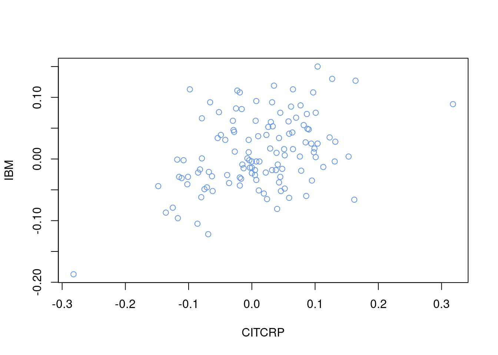{width=672}
:::
:::


Vi ser inga tydliga avvikelser från det linjära antagandet och således är korrelationen ett rimligt mått på sambandet. Figuren visar ett positivt samband mellan variablerna.

Antag att vi vill räkna den parvisa korrelationen mellan flera variabler. Vi skulle kunna repetera koden `cor(IBM ~ CITCRP, data = CAPM)`, där vi byter ut `IBM` och `CITCRP` mot alla parvisa kombinationer av de variablerna vi är intresserade utav. Mer elegant (och mindre tidskrävande!) så kan vi skapa en såkallad korrelationsmatris. För att illustrera korrelationsmatrisen, låt oss betrakta följande variabler: `MARKET`, `RKFREE`, `WEYER`, `BOISE`, `CONED`, `CITCRP` `DATGEN`, `DEC`,`DELTA` och `CPI`. Alla dessa förutom `MARKET`, `RKFREE` och `CPI` är månadsavkastningar för stora börsnoterade företag. `MARKET` är marknadens månadsavkastning, `RKFREE` är avkastningen på en riskfri tillgång (statsobligationsränta) och `CPI` är konsumentprisindex. Låt oss skapa en ny dataframe där vi enbart behåller variablerna av instresse.


::: {.cell}

```{.r .cell-code}
CAPM_10_variables <- CAPM[, c("MARKET", "RKFREE", "WEYER", "BOISE", "CONED", "CITCRP", "DATGEN", "DEC", "DELTA", "CPI")]
head(CAPM_10_variables)
```

::: {.cell-output .cell-output-stdout}
```
  MARKET  RKFREE  WEYER  BOISE  CONED CITCRP DATGEN    DEC  DELTA   CPI
1 -0.045 0.00487 -0.116 -0.079 -0.079 -0.115 -0.084 -0.100 -0.028 166.7
2  0.010 0.00494 -0.135  0.013 -0.003 -0.019 -0.097 -0.063 -0.033 167.1
3  0.050 0.00526  0.084  0.070  0.022  0.059  0.063  0.010  0.070 167.5
4  0.063 0.00491  0.144  0.120 -0.005  0.127  0.179  0.165  0.150 168.2
5  0.067 0.00513 -0.031  0.071 -0.014  0.005  0.052  0.038 -0.031 169.2
6  0.007 0.00527  0.005 -0.098  0.034  0.007 -0.023 -0.021  0.023 170.1
```
:::
:::


Vi kan nu skapa och spara korrelationsmatrisen i en variabel `correlation_matrix_CAPM` genom `cor()`. Notera att input till funktionen är den nya dataframen vi har skapat och att ingen formula-syntax används.


::: {.cell}

```{.r .cell-code}
correlation_matrix_CAPM <- cor(CAPM_10_variables)
round(correlation_matrix_CAPM, 3)
```

::: {.cell-output .cell-output-stdout}
```
       MARKET RKFREE  WEYER  BOISE CONED CITCRP DATGEN    DEC  DELTA    CPI
MARKET  1.000 -0.100  0.656  0.652 0.124  0.564  0.551  0.581  0.349 -0.060
RKFREE -0.100  1.000 -0.142 -0.176 0.057  0.001 -0.102 -0.139  0.007 -0.456
WEYER   0.656 -0.142  1.000  0.751 0.158  0.540  0.481  0.590  0.490  0.067
BOISE   0.652 -0.176  0.751  1.000 0.209  0.590  0.534  0.552  0.454  0.059
CONED   0.124  0.057  0.158  0.209 1.000  0.269  0.096  0.108  0.092  0.054
CITCRP  0.564  0.001  0.540  0.590 0.269  1.000  0.533  0.489  0.397  0.090
DATGEN  0.551 -0.102  0.481  0.534 0.096  0.533  1.000  0.576  0.330 -0.048
DEC     0.581 -0.139  0.590  0.552 0.108  0.489  0.576  1.000  0.429  0.029
DELTA   0.349  0.007  0.490  0.454 0.092  0.397  0.330  0.429  1.000 -0.034
CPI    -0.060 -0.456  0.067  0.059 0.054  0.090 -0.048  0.029 -0.034  1.000
```
:::
:::


Ovan har `round()` funktionen använts för avrunda till tre decimaler så att utskriften blir tydligare. Korrelationsmatrisen anger korrelationen för alla parvisa kombinationer av variabeln. Exempelvis, om vi kollar på rad 4 och kolumn 7 så återfinns korrelationen mellan `BOISE` och `DATGEN` i den cellen, som har värdet 0.534. Korrelationsmatrisen är symmetrisk: om vi kollar på rad 7 och kolumn 4 hittar vi också värdet 0.534, eftersom korrelationen inte tar hänsyn till ordningen.

#### 💪 Uppgift 1.2

Varför är diagonalelementen i korrelationsmatrisen 1?

#### 💪 Uppgift 1.3

Använd `cor()` med formula-syntax för att beräkna korrelationen mellan `DELTA` och `DEC`. Stäm av att resultatet är densamma som korrelationsmatrisen visar (tänk på att vi avrundade, så resultaten kommer inte stämma exakt).


::: {.cell}

```{.r .cell-code}
# Write your code here
```
:::


Informationen i en korrelationsmatris kan vara svår att utläsa pga alltför många siffror. En korrelationsplot illustrerar korrelationerna med färgskalor och är mycket enklare att utläsa. Funktionen `corrplot()` från `corrplot`-paketet tar en korrelationsmatris som argument för att skapa plotten. Vi skapade korrelationsmatrisen ovan (`correlation_matrix_CAPM`).


::: {.cell}

```{.r .cell-code}
suppressMessages(library(corrplot))
```

::: {.cell-output .cell-output-stderr}
```
Warning: package 'corrplot' was built under R version 4.2.2
```
:::

```{.r .cell-code}
corrplot(correlation_matrix_CAPM)
```

::: {.cell-output-display}
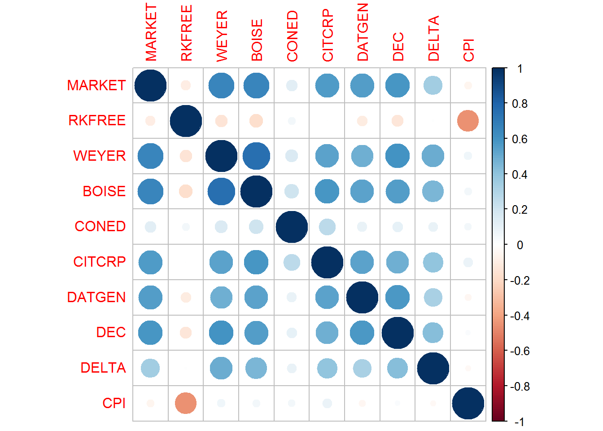{width=672}
:::
:::


#### 💪 Uppgift 1.4

Svara på följande frågor:

-   Hitta två variabler som har en svag negativ korrelation på ungefär -0.2. Använd `plot()` för att plotta variablerna mot varandra.

-   Hitta två variabler som har en svag positiv korrelation på ungefär 0.2. Använd `plot()` för att plotta variablerna mot varandra.

-   Hitta de två variabler som har starkast negativ korrelation. Är det rimligt att dessa variabler är negativt korrelerade?


::: {.cell}

```{.r .cell-code}
# Write your code here
```
:::


Bara för att en korrelation mellan två variabler är nära noll betyder det inte att det inte finns något samband. Låt oss illustrera detta med ett exempel där vi använder slumptal för att skapa två variabler $x$ och $y$ som har ett icke-linjärt samband, men en korrelation som är nära noll. Simulering av slumptal tas upp i andra delen av kursen. Ni behöver inte förstå koden nu, men det är viktigt att ni förstår slutsatsen som snart att presenteras.


::: {.cell}

```{.r .cell-code}
set.seed(10) # Same random numbers generated every run
x <- rnorm(n = 1000, sd = 1) # Simulate a normal variable with standard deviation 1
y <- -5*x^2 + rnorm(n = 1000)
plot(x, y, col = "cornflowerblue")
```

::: {.cell-output-display}
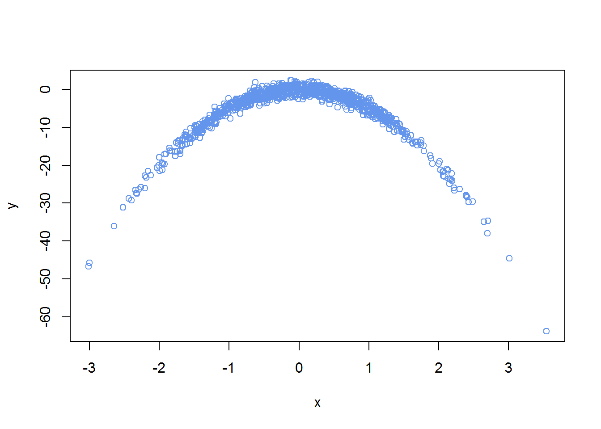{width=672}
:::
:::


Det finns ett uppenbart kvadratiskt samband $y$ och $x$. Låt oss beräkna korrelationen.


::: {.cell}

```{.r .cell-code}
cor(x, y)
```

::: {.cell-output .cell-output-stdout}
```
[1] -0.003297157
```
:::
:::


Korrelationen är nästan noll! Slutsatsen är att om vi bara hade hade fokuserat på korrelationen, utan att plotta $y$ mot $x$, så hade vi alltså missat detta uppenbara samband.

I korrelationsplotten ovan är det många korrelationer som är nära noll och vi måste försäkra oss om att vi inte har missat några uppenbara icke-linjära samband. Vi kan plotta alla parvisa kombinationer av de variablerna vi är intresserade utav med hjälp av `plot()` funktionen. Mer elegant (och mindre tidskrävande!) så kan vi använda funktionen `pairs()` som gör punktdiagram av alla parvisa kombinationer av variablerna i en dataframe.


::: {.cell}

```{.r .cell-code}
pairs(CAPM_10_variables, col = "cornflowerblue")
```

::: {.cell-output-display}
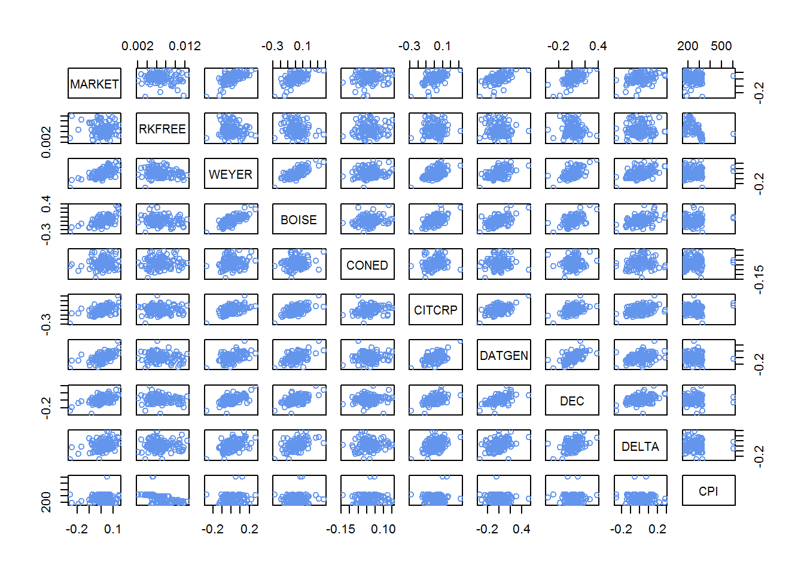{width=672}
:::
:::


#### 💪 Uppgift 1.5

Finns det uppenbara icke-linjära samband för de variablerna som hade nära noll korrelation enligt korrelationsplotten?

#### 💪 Uppgift 1.6

Studera plottarna för variablerna som var korrelerade enligt korrelationsplotten. Kan ni utläsa tecknena på korrelationerna (positiva eller negativa) utifrån punktdiagrammen?

## 2. Enkel linjär regression

En linjär regression är användbar för att beskriva det linjära sambandet mellan en responsvariabel $y$ och en förklarande variabel $x$. Med en anpassad linjär regressionsmodell kan man, likt Avsnitt 1, beräkna korrelationen mellan $y$ och $x$. Men en linjär regressionsmodell erbjuder mer än så. Vi kan t.ex kvantifiera hur en förändring i $x$ är associerad med en förändring i $y$. Och kanske viktigast (och roligast!) av allt: vi kan givet ett nytt $x$ prediktera det genomsnittliga värdet på $y$.

Låt oss illustrera enkel linjär regression med hjälp av datasetet `FevChildren.RData` som illustrerades i [Lab 3](https://statisticssu.github.io/SDA1/datorlab/lab3/DatorLab3.html#samband-mellan-en-numerisk-och-en-kategorisk-variabel). Vi anpassar en enkel linjär regression med responsvariabel utandningsvolymen (`fev`) och förklarande variabel längd (`height`) med hjälp av funktionen `lm()` som står för linear model och sparar resultatet i en variabel vi döper till `lm_fev_vs_height`.


::: {.cell}

```{.r .cell-code}
load(file = url("https://github.com/StatisticsSU/SDA1/blob/main/datorlab/lab3/FevChildren.RData?raw=true"))
lm_fev_vs_height <- lm(fev ~ height, data = FevChildren)
```
:::


Vi ser ovan att `lm()` funktionen använder samma alternativa formula-syntax som `plot()` funktionen, dvs av typen `y ~ x`.

::: {.callout-note icon="false"}
## Extra material för de nyfikna studenterna (detta avsnitt kan skippas)

Funktionen `lm()` returnerar ett **objekt** som är en instans (en realiserad kopia) av **klass** `lm`. En klass är enkelt beskrivet en abstrakt kodmall där det anges vilka variabler som lagras i objektet, så kallade **attribut**, och vilka funktioner som går att använda på objektet. Vi kan se klasstypen genom att anropa `class()` funktionen.


::: {.cell}

```{.r .cell-code}
class(lm_fev_vs_height)
```

::: {.cell-output .cell-output-stdout}
```
[1] "lm"
```
:::
:::


Innehållet i objektet kan visas med anropet `str(lm_fev_vs_height)`, som visar objektets struktur på ett kompakt sätt.

#### 💪 Extra Uppgift 1

Använd `str()` enligt ovan för att få en översikt av innehållet i objektet `lm_fev_vs_height`. Känner du igen några av namnen (som följer efter `$`-tecknet) från föreläsningarna?


::: {.cell}

```{.r .cell-code}
# Write your code here
```
:::


Vi har stött på `$`-tecknet i samband med att vi hämtade ut en variabel från en dataframe i [Lab 3](https://statisticssu.github.io/SDA1/datorlab/lab3/DatorLab3.html#tidsserier): Om `my_data` är en dataframe som innehåller en variabel `x` kommer vi åt den via `my_data$x`. Vi återkommer snart till `$`-tecknet, men låt oss först dyka lite djupare i R.

Vi nämnde inte det i Lab 3, men `my_data` är också ett objekt! Den är en instans av klassen `dataframe`. **I själva verket är allt i R objekt!** R är vad man kallar ett objektorienterat programmeringsspråk. Allt vi skapar i R, vare sig det är en variabel, funktion eller till och med en tabell, är objekt, dvs instanser av olika klasser.


::: {.cell}

```{.r .cell-code}
x <- -3
class(x)
```

::: {.cell-output .cell-output-stdout}
```
[1] "numeric"
```
:::

```{.r .cell-code}
f <- function(x) {x^2} # Simple function that squares a number.
class(f)
```

::: {.cell-output .cell-output-stdout}
```
[1] "function"
```
:::

```{.r .cell-code}
t <- tally(age.group ~ smoking, data = FevChildren)
class(t)
```

::: {.cell-output .cell-output-stdout}
```
[1] "table"
```
:::
:::


#### 💪 Extra Uppgift 2

Använd funktionen 'f()' ovan för att räkna ut $3^2$ och spara resultatet i en variabel `y`. Vilken klass är objektet `y` en instans av? Fundera på svaret innan ni tar reda på det med hjälp av funktionen `class()`.


::: {.cell}

```{.r .cell-code}
# Write your code here
```
:::


Det går att dyka djupare i Rs objektorienterade värld, men vi låter bli och hänvisar istället till institutionens [Introduktionskurs i R-programmering](https://www.su.se/sok-kurser-och-program/st1901-1.617486).

Åter till användandet av `$`-tecknet. Vi använder `$`-tecknet för att hämta ett objekts attribut (en variabel som lagras i objektet). Funktionen `attributes()` listar namnen på de olika attributen.


::: {.cell}

```{.r .cell-code}
attributes(lm_fev_vs_height)
```

::: {.cell-output .cell-output-stdout}
```
$names
 [1] "coefficients"  "residuals"     "effects"       "rank"         
 [5] "fitted.values" "assign"        "qr"            "df.residual"  
 [9] "xlevels"       "call"          "terms"         "model"        

$class
[1] "lm"
```
:::
:::


Exempelvis så lagras minsta kvadratskattningarna i attributet `coefficients`.


::: {.cell}

```{.r .cell-code}
lm_fev_vs_height$coefficients
```

::: {.cell-output .cell-output-stdout}
```
(Intercept)      height 
-5.74145229  0.05380877 
```
:::
:::


#### 💪 Extra Uppgift 3

Gör ett histogram för residualerna för den anpassade modellen ovan.


::: {.cell}

```{.r .cell-code}
# Write your code here.
```
:::

:::

Funktionen `lm()` returnerar ett såkallat objekt (som vi sparat i variabeln `lm_fev_vs_height`) av klass `lm` som förklaras i extra materialet ovan. Vi behöver inte veta detaljerna, men en viktig sak att veta är att det finns många användbara funktioner vi kan applicera på vårt objekt. En sådan funktion är `summary()` som skriver ut resultaten från regressionen i ett snyggt format.


::: {.cell}

```{.r .cell-code}
summary(lm_fev_vs_height)
```

::: {.cell-output .cell-output-stdout}
```

Call:
lm(formula = fev ~ height, data = FevChildren)

Residuals:
     Min       1Q   Median       3Q      Max 
-1.76006 -0.25417  0.00064  0.23903  2.10393 

Coefficients:
             Estimate Std. Error t value Pr(>|t|)    
(Intercept) -5.741452   0.210370  -27.29   <2e-16 ***
height       0.053809   0.001337   40.25   <2e-16 ***
---
Signif. codes:  0 '***' 0.001 '**' 0.01 '*' 0.05 '.' 0.1 ' ' 1

Residual standard error: 0.4327 on 604 degrees of freedom
Multiple R-squared:  0.7284,	Adjusted R-squared:  0.7279 
F-statistic:  1620 on 1 and 604 DF,  p-value: < 2.2e-16
```
:::
:::


Efter Del 2 av kursen kommer ni känna igen i princip allt i utskriften ovan. Det vi har gått på Del 1 är:

-   `Residuals`: Visar fördelningsmåtten för residualerna, samt minsta och största värde.

-   `Coefficients`: `Estimate` kolumnen visar minsta kvadratskattningarna. `Intercept` och `height` betecknar vi med, respektive, $b_0$ och $b_1$ på föreläsningarna.

-   `Residual standard error`: Residualernas standardavvikelse som vi betecknar med $s_e$ på föreläsningarna.

-   `Multiple R-squared`: R-kvadrat som vi betecknar med $R^2$ på föreläsningarna.

-   `Adjusted R-squared`: Justerat R-kvadrat som vi betecknar med $R_{\mathrm{adj}}^2$ på föreläsningarna.

Låt oss tolka resultaten ovan. 72.84% av variationen i forcerad utadningsvolym förklaras av variabeln längd. Minsta kvadratanpassningen är $$\widehat{fev} = b_0 + b_1height =-5.741 + 0.054height.$$ Tolkningen för $b_0=-5.741$ är den predikterade genomsnittliga forcerade utandningsvolymen för barn och ungdomar som är 0 cm långa, vilket inte är meningsfullt. Vi kan inte göra en kausal tolkning för $b_1$ eftersom det inte är så att längden medför bättre eller sämre lugnkapacitet. Istället säger vi att barn och ungdomar som är 1 cm längre tenderar att i genomsnitt ha $b_1=0.054$ fler enheter forcerad utandningsvolym (än de som är 1 cm kortare). Vi kan också använda oss av $b_1$ för att till exempel säga att barn och ungdomar som är 10 cm längre tenderar att ha $10\cdot b_1 = 0.54$ fler enheter forcerad utandningsvolym (än de som är 10 cm kortare).

Vårt dataset innehåller forcerad utandningsvolym och längd hos 606 individuella barn och ungdomar. Vår anpassade modell ger oss 606 prediktioner av de genomsnittliga forcerade utandningsvolymerna, dvs en prediktion $\hat{y}_i$ (`fev`) för varje $x_i$ (`height`) i datasetet. Dessa kan fås genom funktionen `predict()`. Låt oss plotta data tillsammans med de predikterade värden i samma figur med hjälp av funktionen `lines()` som användes i [Lab 3](https://statisticssu.github.io/SDA1/datorlab/lab3/DatorLab3.html#tidsserier). Vi använder också funktionen `abline()` som ritar den räta linjen (minsta kvadratanpassningen).


::: {.cell}

```{.r .cell-code}
plot(fev ~ height, data = FevChildren, col = "cornflowerblue", ylim = c(0, 7))
y_hat <- predict(lm_fev_vs_height)
head(y_hat)
```

::: {.cell-output .cell-output-stdout}
```
       1        2        3        4        5        6 
2.048981 3.484061 1.707295 1.502284 2.048981 2.595678 
```
:::

```{.r .cell-code}
lines(FevChildren$height, y_hat, type = "p", col = "lightcoral")
abline(lm_fev_vs_height, col = "lightcoral")
legend(x = "topleft", pch = c(1, 1, NA), lty = c(NA, NA, 1), col = c("cornflowerblue", "lightcoral", "lightcoral"), legend=c("Data", "Predicted", "Fitted line"))
```

::: {.cell-output-display}
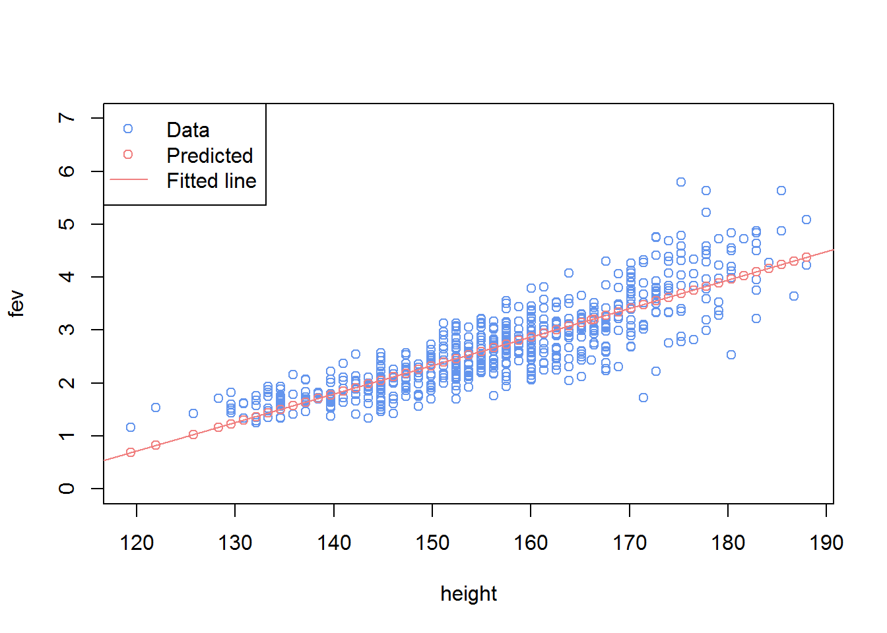{width=672}
:::
:::


Det enda argumentet ni inte har stött på tidigare är `pch = c(1, 1, NA)` som anger att de två första ska vara cirkelsymboler i legendtexten och anger ingen cirkelsymbol för den sista. Argumentet `lty = c(NA, NA, 1)` anger en linje för den sista men ingen linje för de två första.

Antag att vi vill prediktera genomsnittliga forcerade utandningsvolymen för längder som inte finns med bland de 606 observationerna, exempelvis $x=150$ och $x=160$. Vi kan använda `predict()` funktionens argument `newdata` som är en dataframe med samma variabelnamn som vi använde när vi anpassade modellen (`height`) i vårt fall. Följande kod skapar dataframen i en variabel vi väljer att kalla `new_x` och predikterar de genomsnittliga forcerade utandningsvolymerna för de nya $x$ värden ovan.


::: {.cell}

```{.r .cell-code}
new_x <- data.frame(height = c(160, 170))
predict(lm_fev_vs_height, newdata = new_x)
```

::: {.cell-output .cell-output-stdout}
```
       1        2 
2.867951 3.406038 
```
:::
:::


Exempelvis ser vi att ett barn (eller en ungdom) på 170 cm har i genomsnitt ett `fev`-värde på ca 3.4.

#### 💪 Uppgift 2.1

Prediktera responsen för $x=180$ och $x=190$. Tolka resultaten.


::: {.cell}

```{.r .cell-code}
# Write your code here
```
:::


För att kolla modellens rimlighet kan vi göra en residualanalys. Följande tre kriterier är viktiga:

-   Residualerna ska bete sig slumpmässigt, dvs de ska inte uppvisa ett mönster.

-   Residualernas varians ska vara konstant, dvs inte bero på $x$.

-   Residualerna ska vara approximativt normalfördelade.

De två senare kriterierna blir viktiga när vi gör inferens i regressionsmodellen (Del 2) av kursen. När första kriterier inte är uppfyllt betyder det ofta att sambandet i data är icke-linjärt.

Residualerna kan fås genom funktionen `residuals()`:


::: {.cell}

```{.r .cell-code}
resid <- residuals(lm_fev_vs_height)
head(resid)
```

::: {.cell-output .cell-output-stdout}
```
          1           2           3           4           5           6 
-0.34098108 -1.76006091  0.01270459  0.05571600 -0.15398108 -0.25967816 
```
:::
:::


Följande kod gör residualanalysen.


::: {.cell}

```{.r .cell-code}
plot(FevChildren$height, resid, xlab= "height", ylab='Residuals', col = "cornflowerblue") 
```

::: {.cell-output-display}
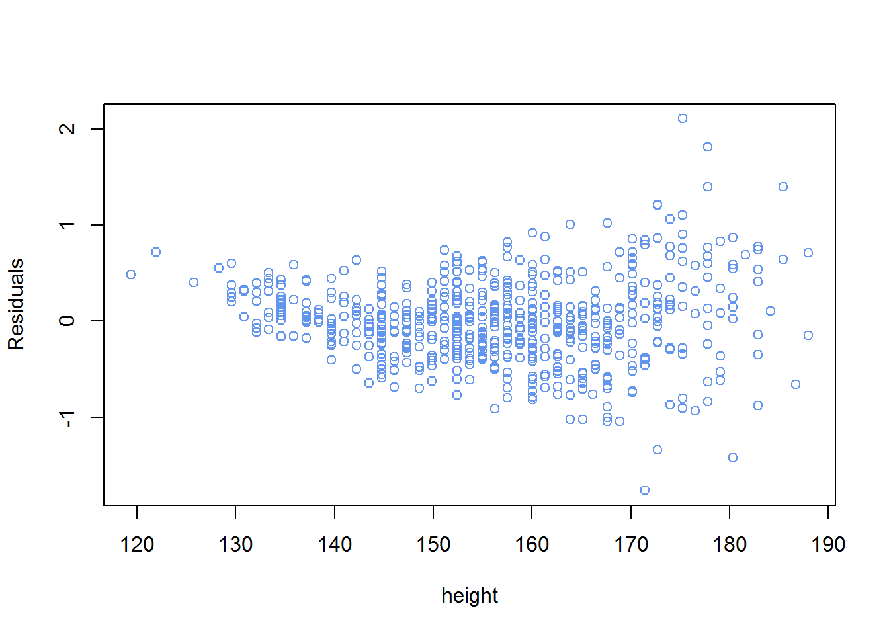{width=672}
:::

```{.r .cell-code}
qqnorm(resid, col = "cornflowerblue") # Create normal probability plot for residuals
qqline(resid, col = "red") # Add a straight line to normal probability plot 
```

::: {.cell-output-display}
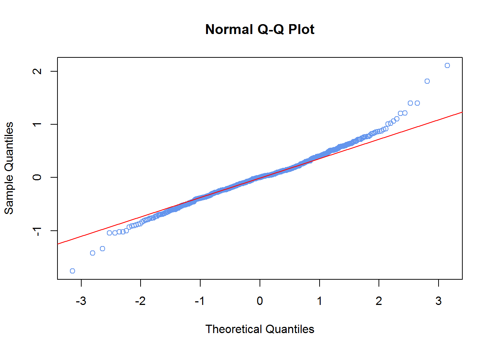{width=672}
:::
:::


Första plotten visar att residualerna inte ter sig slumpmässigt --- de visar ett, om än svagt, kvadratiskt samband. Plotten visar också en tydlig indikation på att residualernas varians inte är konstant, eftersom de varierar mer ju större `height` blir.

Dessa resultat är inte överraskande om vi noga betraktar punktdiagrammet `fev` mot `height` igen samt den anpasssade linjen.


::: {.cell}

```{.r .cell-code}
plot(fev ~ height, data = FevChildren, col = "cornflowerblue")
abline(lm_fev_vs_height, col = "lightcoral")
```

::: {.cell-output-display}
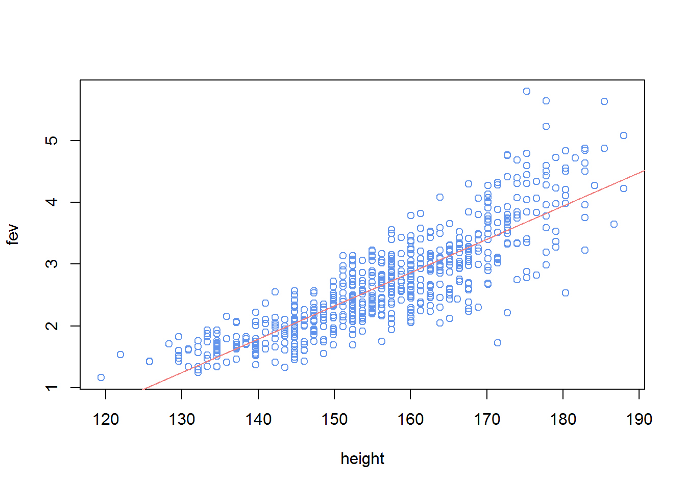{width=672}
:::
:::


Residualerna beräknas som avståndet mellan observationerna och dess predikterade värden (som ligger på linjen). Större avvikelser förekommer för större värden på `height` jämfört med mindre värden, därav en högre residualvarians. Data verkar inte heller följa den räta linjen eftersom en liten grad av icke-linjaritet verkar finnas. I Avsnitt 3 går vi i igenom hur vi kan anpassa en icke-linjär regression för att få bättre resultat.

#### 💪 Uppgift 2.2

Exemplet ovan visar hur man anpassar en enkel linjär regression, tolkar resultaten, predikterar responsen för nya $x$ värden och slutligen hur man validerar modellen. Gör en regressionsanalys med responsvariabel `IBM` och förklarande variabel `MARKET` i `CAPM_data.RData` som inkluderar dessa steg. För prediktion, antag att vi vill förutspå vad som händer med IBM aktien om det sker en börskrasch och marknadsportföljen faller med 15% under en månad. Vad kan man förutsäga om IBM aktiens månadsavkastning i ett sådant scenario?


::: {.cell}

```{.r .cell-code}
# Write your code here
```
:::


## 3. Enkel icke-linjär regression

I Avsnitt 2 såg vi att regressionslinjen $$\widehat{fev} = b_0 + b_1height$$ inte var tillräcklig. Vi kan använda icke-linjär regression för att få en bättre anpassning till data. Icke-linjär regression transformerar data så att sambandet blir linjärt efter att transformering. Tranformationerna syfte är alltså att "räta ut" data och vi kan visuellt inspektera om så är fallet. Ett annat syfte med transformationer är att de ibland gör antagandet om konstant residualvarians mer troligt, vilket också kan studeras visuellt.

Vi använder oss av den så kallade **ladder of powers** (stege av potenstransformationer) för att "räta ut" data med hjälp av potenstransformationer. Stegen av potenstransformationer visas nedan.

| Stegnivå |     $y$     |     $x$     |
|:---------|:-----------:|:-----------:|
| 1        |    $y^2$    |    $x^2$    |
| 2        |     $y$     |     $x$     |
| 3        |  $y^{1/2}$  |  $x^{1/2}$  |
| 4        |  $\log(y)$  |  $\log(x)$  |
| 5        | $-y^{-1/2}$ | $-x^{-1/2}$ |
| 6        |  $-y^{-1}$  |  $-x^{-1}$  |

: Potenstransformationer för $y$ och $x$.

Tukeys cirkel är en tumregel för hur vi flyttar oss upp och ner i stegen.

{fig-align="center" width="333"}

Vi börjar med att både $y$ och $x$ befinner sig på stegnivå 2 och flyttar sig sedan uppåt eller nedåt beroende på var i Tukeys cirkel vi befinner oss. Plotten `fev` mot `height` indikerar att vi befinner oss i fjärde kvadranten i Tukeys cirkel. Vi ska alltså gå ner i stegen för $y$ och/eller upp i stegen för $x$ tills förhållandet ser mer linjärt ut. Och/eller här betyder att man "flyttar båda"/"flyttar enbart en". Notera också att en av variablerna kan stanna i stegen medan man flyttar den andra uppåt eller nedåt fler än ett steg.


::: {.cell}

```{.r .cell-code}
plot(fev ~ height, data = FevChildren, col = "cornflowerblue")  # Starting point: Both y and x  untransformed (Step 2 in the ladder of powers) 
```

::: {.cell-output-display}
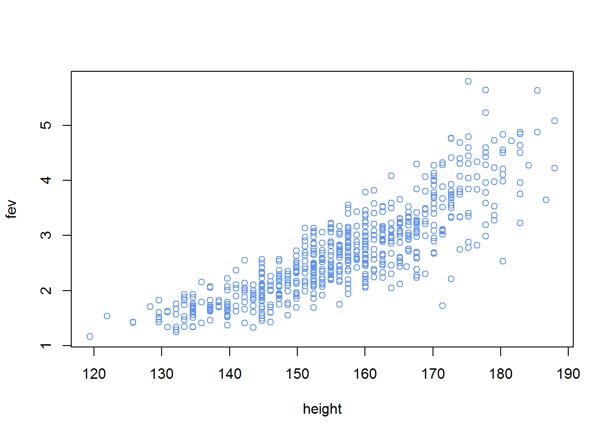{width=672}
:::

```{.r .cell-code}
plot(sqrt(fev) ~ height, data = FevChildren, col = "cornflowerblue") # y down in the ladder of powers
```

::: {.cell-output-display}
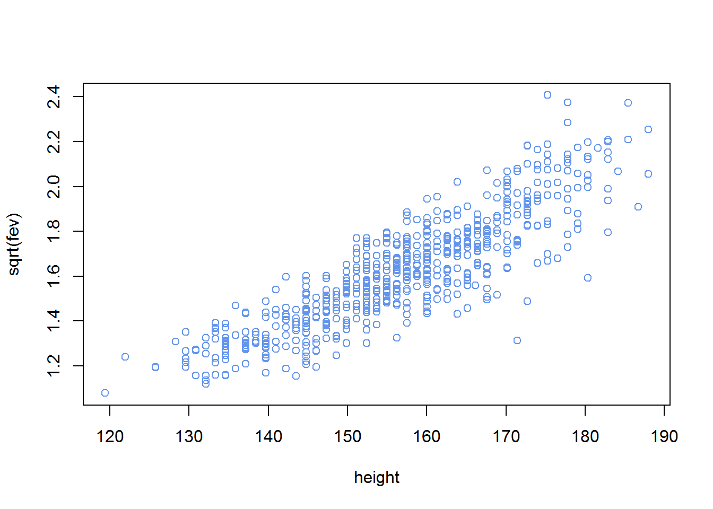{width=672}
:::

```{.r .cell-code}
plot(fev ~ I(height^2), data = FevChildren, col = "cornflowerblue") # x up in the ladder of powers
```

::: {.cell-output-display}
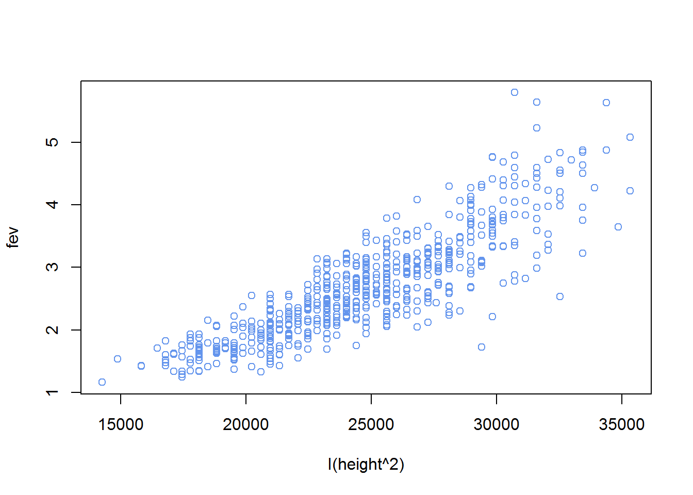{width=672}
:::

```{.r .cell-code}
plot(sqrt(fev) ~ I(height^2), data = FevChildren, col = "cornflowerblue") # y down and x up in the ladder of powers
```

::: {.cell-output-display}
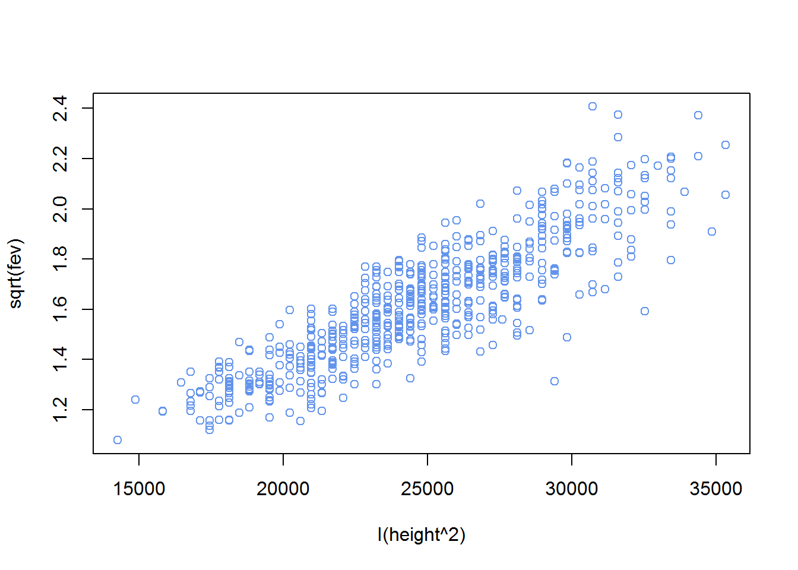{width=672}
:::

```{.r .cell-code}
plot(log(fev) ~ I(height), data = FevChildren, col = "cornflowerblue") # y down two steps
```

::: {.cell-output-display}
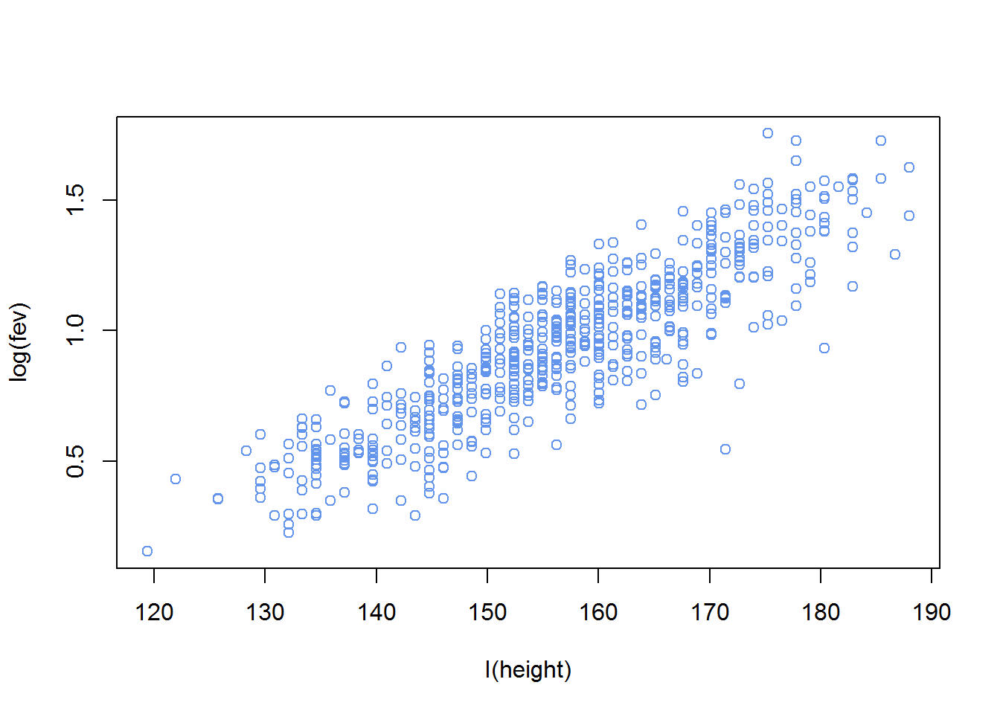{width=672}
:::
:::


Vi kommenterar den mystiska funktionen `I()` som dyker upp i högerledet på formula-syntaxen `y ~ I(x^2)` i rutan nedan. Man kan hoppa över rutan, det enda viktiga är att veta att **funktionen `I()` behöver användas i högerledet av formula-syntax om man vill transformera `x` för att inga misstolkningar ska ske.**

::: {.callout-note icon="false"}
## Extra förklaring för de nyfikna studenterna (detta avsnitt kan skippas)

Formula-syntaxen tillåter att man applicerar en transformation i vänsterledet utan att använda `I()`, dvs vi kan skriva till exempel `sqrt(y) ~ x` istället för `I(sqrt(y)) ~ x`. Detsamma gäller inte högerledet eftersom i formula-syntax så har vissa operationer en annan betydelse när de utförs på den förklarande variabeln. Till exempel anpassar `lm(y ~ x*z)` en linjär regression med så kallade interakationseffekter[^1] mellan de förklarande variablerna $x$ och $z$, vilket har formen $$\hat{y} = b_0 + b_1x + b_2 z  + b_3xz.$$ När man använder funktionen `I()` i högerledet undgår man att formula-syntax tolkar fel.
:::

[^1]: Interaktionseffekter gås igenom i Statistisk och Dataanalys II.

Vi skulle kunna utvärdera vilken av transformationerna är att föredra med korsvalidering (se Avsnitt 5). Här nöjer vi oss med en utvärdering baserad på grafernas utseende. Vi ser att alla transformationerna resulterar i ett mer linjärt förhållande jämfört med ursprungsdatan (innan transformationerna). Visuellt konstaterar vi att de två sista transformationerna verkar rätar ut data bäst. Vi väljer den sista transformationen eftersom den verkar uppnå en jämnare spridning runt linjen, vilket kommer resultera i residualer med en mer konstant varians.

Den anpassade linjen har formen $$\widehat{\log(fev)} = b_0 + b_1height,$$ där vi snart ska använda `lm()` för att beräkna koefficienterna $b_0$ och $b_1$. Men först en viktig varning.

::: callout-warning
I linjär regression tolkade vi $b_1$ som förändringen i responsvariablen $y$ som är associerad med en en-enhets förändring i den förklarande variabeln $x$.

När man transformerar $x$ så finns det inga enkla tolkningar av $b_1$, oavsett om $y$ är transformerad eller inte!

När man enbart transformerar $y$ men inte $x$ är tolkningen i den transformerade skalan. I vårt exempel är $b_1$ den förändringen i $\log(y)$ som är associerad med en en-enhets förändring i den förklarande variabeln $x$. Man kan ibland, beroende på transformationen av $y$, använda $b_1$ för att få en enkel tolkning även i den originala skalan. Vi går inte igenom sådana tolkningar av $b_1$ för icke-linjär regression i den här kursen[^2].
:::

[^2]: Statistik och Dataanalys II går igenom ett par icke-linjära modeller som är tolkningsbara. Den kommande nya kursen Generaliserade Linjära Modeller som läses efter Statistik och Datanalys III går igenom många fler tolkningsbara icke-linjära modeller.

Är det ens värt att anpassa en modell där koefficienterna inte går att tolka på ett enkelt sätt? Om målet med modellen är att prediktera bättre (jämfört med en linjär regression) så är svaret definitivt ja[^3].

[^3]: Ett modernt exempel på modeller som saknar tolkning men är extremt bra på prediktera är djupa neurala nätverk (deep learning). Ni får lära er om dessa i vår kurs Maskininlärning på masternivå.

Precis som i Avsnitt 2 kan vi använda minsta kvadratmetoden (genom `lm()`) för att anpassa modellen på de transformerade data. När vi använder prediktion måste vi tänka på att vi har transformerat variablerna. I det här specifika exemplet med tranformationen `log(fev)` kommer funktionen `predict()` att prediktera den genomsnittliga $\log(fev)$ nivån. Vi vill prediktera i originalskala, dvs responsvariabeln $y$ (`fev`) och inte $\log(y)$ (`log(fev)`). Men vi kan använda prediktionen för $\log(y)$ och "reversera transformationen", dvs få transformationen ogjord, för att beräkna prediktionen för $y$. En funktion som reverserar en transformation kallas för en inverstransformation. Tabellen nedan anger inversetransformationerna (kolumnen till höger) vi kan använda oss av när vi predikterar i originalskala. Transformationerna motsvarar de i ladder of powers.

| Transformation av responsen | Prediktion i $y$-skala ($\widehat{y}$) |
|:---------------------------:|:--------------------------------------:|
|            $y^2$            |   $\left(\widehat{y^2}\right)^{1/2}$   |
|             $y$             |             $\widehat{y}$              |
|          $y^{1/2}$          |   $\left(\widehat{y^{1/2}}\right)^2$   |
|          $\log(y)$          |  $\exp\left(\widehat{\log(y)}\right)$  |
|         $-y^{-1/2}$         |  $\left(\widehat{-y^{-1/2}}\right)^2$  |
|          $-y^{-1}$          | $-\left(\widehat{-y^{-1}}\right)^{-1}$ |

: Prediktion i originalskala (kolumn till höger) för olika transformerade responser (kolumn till vänster).

::: {.callout-note icon="false"}
## Extra förklaring för de nyfikna studenterna (detta avsnitt kan skippas)

Låt transformationen av $y$ betecknas $\tilde{y}$. Vi kan härleda den inversa transformationen genom att lösa för $y$ i ekvationen $\tilde{y}=g(y)$ där $g()$ är transformationen.

Låt oss härleda den inversa transformationen av log-transformationen. Eftersom $\tilde{y}=\log(y)$ så är $$\exp\left( \tilde{y} \right) = \exp(\log(y)) \implies y = \exp\left( \tilde{y} \right),$$ dvs exponential-funktionen är den inversa transformen.

Notera att när vi predikterar $y$ (responsen i originalskala) så sker det i två steg. I det första steget använder vi regressionen för att prediktera $\tilde{y}$ (responsen i transformed skala, log-skala i exemplet ovan), vilket ger prediktionen $\widehat{\tilde{y}}$ ($\widehat{\log(y)}$ i exemplet ovan). I andra steget applicerar vi den inversa transformen ($\exp()$ för log-transformationen) på $\widehat{\tilde{y}}$ för att få $\widehat{y}$ ($\exp\left(\widehat{\log(y)}\right)$ i exemplet ovan) som är prediktionen av $y$ (originalskala).

#### 💪 Extra Uppgift 4

Härled alla de övriga (eller så många du orkar) inversa transformationerna i tabellen ovan.
:::

Vi är nu redo att anpassa den nya regressionen $$\widehat{\log(fev)} = b_0 + b_1height,$$ samt prediktera och genomföra en residualanalys.


::: {.cell}

```{.r .cell-code}
lm_logfev_vs_height <- lm(log(fev) ~ height, data = FevChildren)
summary(lm_logfev_vs_height)
```

::: {.cell-output .cell-output-stdout}
```

Call:
lm(formula = log(fev) ~ height, data = FevChildren)

Residuals:
     Min       1Q   Median       3Q      Max 
-0.69706 -0.09037  0.01058  0.08988  0.43795 

Coefficients:
              Estimate Std. Error t value Pr(>|t|)    
(Intercept) -2.2227934  0.0717623  -30.97   <2e-16 ***
height       0.0202071  0.0004561   44.31   <2e-16 ***
---
Signif. codes:  0 '***' 0.001 '**' 0.01 '*' 0.05 '.' 0.1 ' ' 1

Residual standard error: 0.1476 on 604 degrees of freedom
Multiple R-squared:  0.7647,	Adjusted R-squared:  0.7643 
F-statistic:  1963 on 1 and 604 DF,  p-value: < 2.2e-16
```
:::
:::


Minsta kvadratskattningarna är nu $b_0=-2.222$ och $b_1=0.020$. $R^2=0.76145$ betyder att ca 76% av variationen i `log(fev)` (observera log i tolkningen!) förklaras av `height`.


::: {.cell}

```{.r .cell-code}
logy_hat <- predict(lm_logfev_vs_height) # log scale prediction
y_hat <- exp(logy_hat) # original scale prediction
head(logy_hat)
```

::: {.cell-output .cell-output-stdout}
```
        1         2         3         4         5         6 
0.7027882 1.2417111 0.5744732 0.4974842 0.7027882 0.9080922 
```
:::

```{.r .cell-code}
head(y_hat)
```

::: {.cell-output .cell-output-stdout}
```
       1        2        3        4        5        6 
2.019375 3.461531 1.776195 1.644579 2.019375 2.479587 
```
:::

```{.r .cell-code}
plot(fev ~ height, data = FevChildren, col = "cornflowerblue", ylim = c(0, 7)) # Data on original scale
lines(FevChildren$height, y_hat, type = "p", col = "lightcoral")
legend(x = "topleft", pch = c(1, 1), col = c("cornflowerblue", "lightcoral"), legend=c("Data", "Predicted"))
```

::: {.cell-output-display}
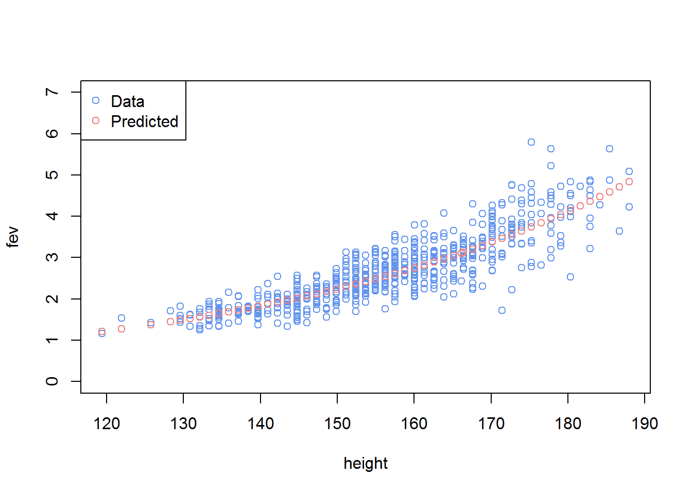{width=672}
:::
:::


Notera att till skillnad från när vi anpassade `fev ~ height` så använder vi här inte `abline()` (som ritar en rät linje), eftersom regressionen är icke-linjär. Vi nöjer oss med att markera ut de enskilda prediktionsvärden, men se rutan nedanför på hur man kan göra om man vill rita en kurva.

::: {.callout-note icon="false"}
## Extra: Rita den anpassade kurvan i icke-linjär regression

Notera att eftersom observationerna inte ligger i ordning för $x$ variabeln så kan vi inte binda ihop de röda punkterna ovan med en linje. Det ser konstigt ut som följande figur visar:


::: {.cell}

```{.r .cell-code}
plot(fev ~ height, data = FevChildren, col = "cornflowerblue", ylim = c(0, 7), main = "Strange looking plot") # Data on original scale
lines(FevChildren$height, y_hat, type = "p", col = "lightcoral") # Prediction of data points
lines(FevChildren$height, y_hat, type = "l", col = "lightcoral") # line
legend(x = "topleft", pch = c(1, 1), col = c("cornflowerblue", "lightcoral"), legend=c("Data", "Predicted"))
```

::: {.cell-output-display}
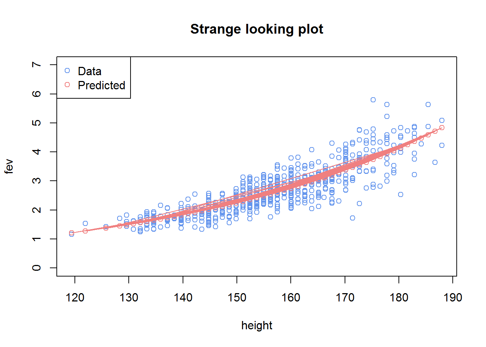{width=672}
:::
:::


Man skulle kunna sortera datasetet i stigande ordning på height och sedan binda ihop varje punkt med en linje. Men om punkterna ligger med en bit avstånd i $x$-led så är inte det här en bra lösning, eftersom det dras en rät linje mellan punkterna och kurvan vi plottar är inte rät. En bättre lösning är att skapa ett rutnät (grid på engelska) med många punkter i $x$-led och sedan prediktera för varje punkt i rutnätet. Ett rutnät är en indelning av ett intervall $[a,b]$ i $N$ punkter med lika stort avstånd mellan varandra. Anropet `seq(a, b, length.out = N)` skapar ett rutnät.


::: {.cell}

```{.r .cell-code}
grid <- seq(0.1, 1, length.out = 10) # a = 0.1, b = 1 and N = 10.
grid
```

::: {.cell-output .cell-output-stdout}
```
 [1] 0.1 0.2 0.3 0.4 0.5 0.6 0.7 0.8 0.9 1.0
```
:::
:::


Vi kan nu skapa en dataframe som innehåller ett rutnät mellan det minsta $x$-värdet och det största $x$-värdet med säg $N=1000$ punkter och prediktera responsen för dessa 1000 $x$-värden. Funktionen 'lines()' kommer att binda ihop dessa punkter med räta linjer emellan --- men punkterna ligger så tätt att våra ögon kommer uppfatta resultatet som en fin och jämn kurva. Följande kod anpassar kurvan på sättet som beskrivits ovan och plottar den tillsammans med data och de enskilda prediktionerna vi skapade ovan.


::: {.cell}

```{.r .cell-code}
plot(fev ~ height, data = FevChildren, col = "cornflowerblue", ylim = c(0, 7)) # Data on original scale
x_min <- min(FevChildren$height) # Min height
x_max <- max(FevChildren$height) # Max height
N <- 1000 # Number of grid points to predict
new_x <- data.frame(height = seq(x_min, x_max, length.out = N)) # The grid in a dataframe
logy_hat_grid <- predict(lm_logfev_vs_height, newdata = new_x)
yhat_grid <- exp(logy_hat_grid) # Inverse transform
lines(FevChildren$height, y_hat, type = "p", col = "lightcoral") # Prediction of data points
lines(new_x$height, yhat_grid, type = "l", col = "lightcoral") # Prediction on grid
legend(x = "topleft", pch = c(1, 1, NA), lty = c(NA, NA, 1), col = c("cornflowerblue", "lightcoral", "lightcoral"), legend=c("Data", "Predicted", "Fitted curve"))
```

::: {.cell-output-display}
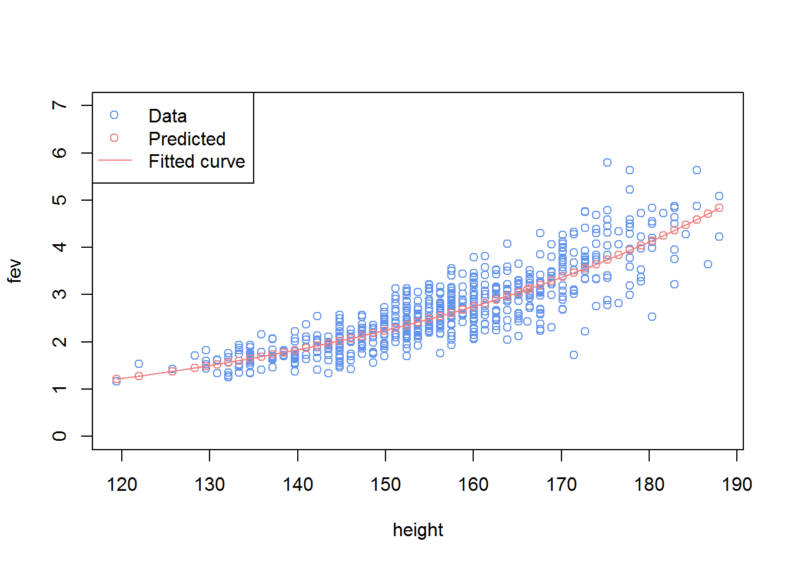{width=672}
:::
:::

:::

#### 💪 Uppgift 3.1

Prediktera responsen för $x=180$ och $x=190$ med den icke-linjära regressionen. Jämför resultaten med den linjära regressionen i Uppgift 2.1.


::: {.cell}

```{.r .cell-code}
# Write your code here
```
:::


Slutligen gör vi en residualanalys.


::: {.cell}

```{.r .cell-code}
resid_logfev <- residuals(lm_logfev_vs_height)
head(resid_logfev)
```

::: {.cell-output .cell-output-stdout}
```
          1           2           3           4           5           6 
-0.16746509 -0.69706393 -0.03214892 -0.05408127 -0.06356935 -0.05965209 
```
:::

```{.r .cell-code}
plot(FevChildren$height, resid_logfev, xlab= "height", ylab='Residuals', col = "cornflowerblue") 
```

::: {.cell-output-display}
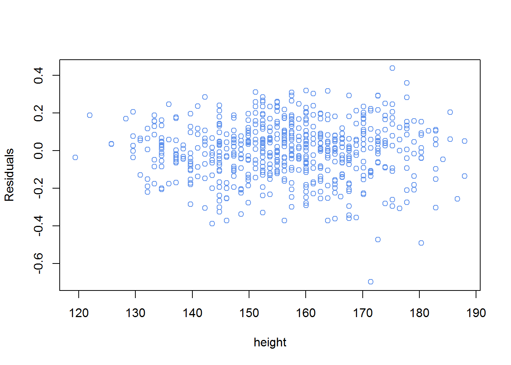{width=672}
:::

```{.r .cell-code}
qqnorm(resid_logfev, col = "cornflowerblue") # Create normal probability plot for residuals
qqline(resid_logfev, col = "red") # Add a straight line to normal plot 
```

::: {.cell-output-display}
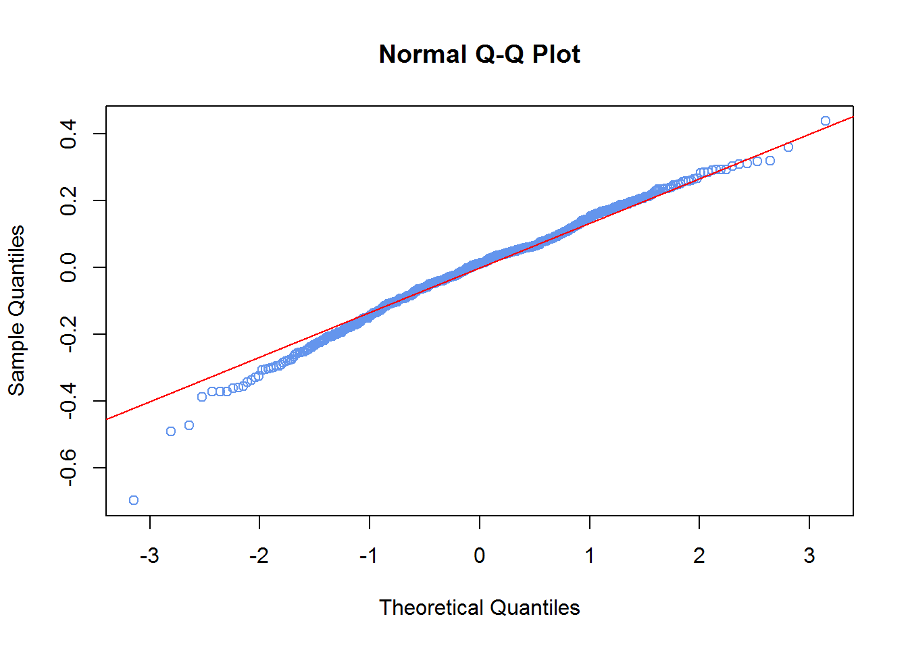{width=672}
:::
:::


#### 💪 Uppgift 3.2

Kommentera residualanalysen för den nya modellen. Jämför resultaten mot residualanalysen för den otransformerade responsen (dvs `fev ~ height`). Vilken modell är att föredra?

#### 💪 Uppgift 3.3

Anpassa modellen $$\widehat{fev^{1/2}} = b_0 + b_1height.$$ och utför en liknande analys som för modellen ovan, dvs $$\widehat{\log(fev)} = b_0 + b_1height.$$ Vilken utav dessa är mest lämplig för det här exemplet?


::: {.cell}

```{.r .cell-code}
# Write your code here
```
:::


## 4. Multipel linjär samt icke-linjär regression

En multipel linjär regression tillåter fler förklarande variabler. Att implementera multipel linjär regression i R kräver inte mycket mer kunskap än det vi har gått igenom ovan.

Vi analyserar återigen `FevChildren.RData` och inkluderar nu också `smoking` (som är en dummy-variabel) för att förklara `fev`, dvs $$\widehat{fev}=b_0 + b_1height + b_2smoking$$


::: {.cell}

```{.r .cell-code}
lm_fev_vs_height_smoking <- lm(fev ~ height + smoking, data = FevChildren)
summary(lm_fev_vs_height_smoking)
```

::: {.cell-output .cell-output-stdout}
```

Call:
lm(formula = fev ~ height + smoking, data = FevChildren)

Residuals:
     Min       1Q   Median       3Q      Max 
-1.76487 -0.25513  0.00027  0.23445  2.09853 

Coefficients:
             Estimate Std. Error t value Pr(>|t|)    
(Intercept) -5.763158   0.216872 -26.574   <2e-16 ***
height       0.053963   0.001388  38.865   <2e-16 ***
smoking1    -0.025260   0.060666  -0.416    0.677    
---
Signif. codes:  0 '***' 0.001 '**' 0.01 '*' 0.05 '.' 0.1 ' ' 1

Residual standard error: 0.433 on 603 degrees of freedom
Multiple R-squared:  0.7285,	Adjusted R-squared:  0.7276 
F-statistic: 808.9 on 2 and 603 DF,  p-value: < 2.2e-16
```
:::
:::


Från utskriften kan vi utläsa att $b_0 = -5.763$, $b_1 = 0.054$ och $b_2=-0.025$. Vidare kan vi utläsa att ca 73 av variationen i `fev` förklaras av `height` och `smoking` Notera att R har kallat variabeln `smoking1` istället för `smoking` för att betona att $b_2$ är effekten av gruppen som röker (vi kodade rökning som 1). I en multipel regression så tolkar vi alltid de skattade effektena av en variabel givet att alla andra variablerna hålls konstanta. Till exempel, givet barn och ungdomar av samma längd så är $b_2$ förändringen (här negativt då $b_2 < 0$) i `fev` mellan rökare och inte rökare. Dvs, givet att längden är densamma, så tenderar rökare att ha mindre forcerad utandningsvolym jämfört med icke-rökare. Koefficienten $b_1$ tolkas givet att smoking hålls konstant, dvs barn och ungdomar som är 1 cm längre tenderar att i genomsnitt ha $b_1=0.054$ fler enheter forcerad utandningsvolym (än de som är 1 cm kortare) givet att de tillhör samma grupp (antingen rökare eller icke-rökare).

I multipel regression är det vanligt att plotta residualerna mot de predikterade värdena, snarare än mot varje förklarande variabel. Detta beror på att man potentiellt kan ha många förklarande variabler och då är det mer praktiskt att istället göra residualanalysen utifrån en enda figur.


::: {.cell}

```{.r .cell-code}
resid_fev_multiplereg <- residuals(lm_fev_vs_height_smoking)
head(resid_fev_multiplereg)
```

::: {.cell-output .cell-output-stdout}
```
          1           2           3           4           5           6 
-0.34166549 -1.76486977  0.01300219  0.05660280 -0.15466549 -0.26193379 
```
:::

```{.r .cell-code}
plot(lm_fev_vs_height_smoking$fitted.values, resid_fev_multiplereg, xlab= "y_hat", ylab='Residuals', col = "cornflowerblue") 
```

::: {.cell-output-display}
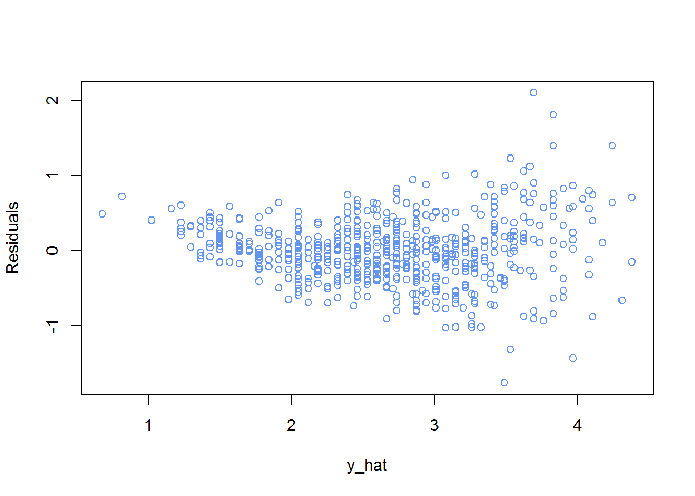{width=672}
:::

```{.r .cell-code}
qqnorm(resid_fev_multiplereg, col = "cornflowerblue") # Create normal probability plot for residuals
qqline(resid_fev_multiplereg, col = "red") # Add a straight line to normal 
```

::: {.cell-output-display}
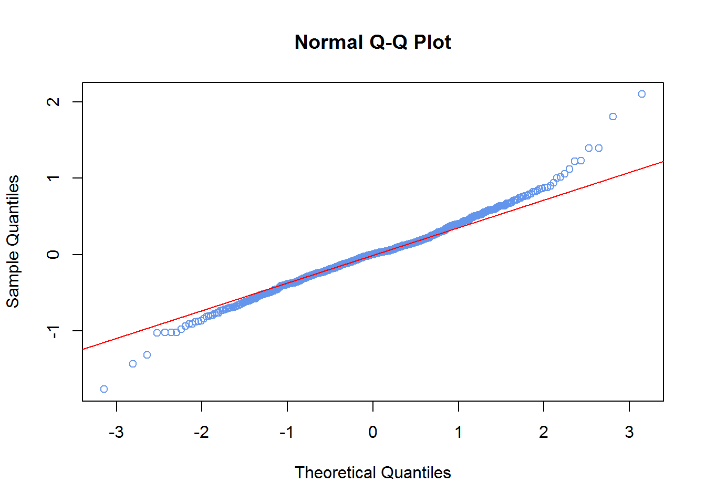{width=672}
:::
:::


Vi ser liknande problem med residualplottarna som i Avsnitt 2.

Antag att vi vill prediktera den genomsnittliga forcerade utandningsvolymen för barn och ungdomar som är 164.5 cm långa och röker. Eftersom `smoking` är en såkallad `factor` variabel (Rs sätt att koda kategoriska variabler) behöver vi använda `as.factor()` funktionen när vi skapar `new_x`.


::: {.cell}

```{.r .cell-code}
new_x <- data.frame(height = 164.5, smoking = as.factor(1))
predict(lm_fev_vs_height_smoking, newdata = new_x)
```

::: {.cell-output .cell-output-stdout}
```
       1 
3.088564 
```
:::
:::


Vår prediktion är att den genomsnittliga forcerade utandningsvolymen är 3.088 för rökande barn och ungdomar som är $164.5$ cm långa.

#### 💪 Uppgift 4.1

Anpassa modellen $$\widehat{\log(fev)}=b_0 + b_1height + b_2smoking.$$ Tolka koefficienterna och utför en residualanalys samt gör en prediktion enligt ovan. Ser resultaten bättre ut?


::: {.cell}

```{.r .cell-code}
# Write your code here
```
:::


#### 💪 Uppgift 4.2

Filen `real_estate.RData` innehåller försäljningspriser `SalesPrice` samt förklarande variabler för 521 sålda objekt. En mäklarfirma anlitar er som statistiker med följande uppdrag.

Mäklarfirman vill att ni utvecklar en prognosmodell för försäljningspriset. För enkelhets skull ska ni anpassa en multipel linjär regression (dvs inga transformationer!) med följande förklarande variabler:

-   `SqFeet`: Area i kvadratfot (enhet 1000 sqft).
-   `Lot`: Tomtarea i kvadratfot (enhet 1000 sqft).
-   `Air`: Dummy-variabel som anger om objektet har luftkonditionering (1 kodat som ja, 0 kodat som nej).

Mäklarfirman undrar följande utifrån den multipla linjära regressionen:

-   Vad kan man säga om sambandet mellan `SqFeet` och försäljningspriset?
-   Vad kan man säga om sambandet mellan `Lot` och försäljningspriset?
-   Verkar det finnas något samband försäljningspriset och `Air`? Hur ska sambandet tolkas?
-   En visning äger rum snart för en lägenhet som har en area på 2.311 kvadratfot, en tomtarea på 17.312 kvadratfot och luftkonditionering. Vad kan den säljas för? Kommunicera er prediktion med en tydlig tolkning.\
-   Har er modell några brister?


::: {.cell}

```{.r .cell-code}
load(file = url("https://github.com/StatisticsSU/SDA1/blob/main/datorlab/lab4/RealEstate.RData?raw=true"))
# Write your code here
```
:::


## 5. Modellval genom Korsvalidering

I det här avsnittet ska vi gå igenom hur man väljer en modell med hjälp av korsvalidering.

Datasetet `Penguins.RData` innehåller dykpuls (DHR) (`dive_heart_rate`) och tid för dykning (`duration`) för 125 pingviner. Vi vill modellera dykpulsen för en pingvin som en funktion av tiden för dykningen. Ett punktdiagram visar att en linjär regression inte kommer att anpassa data väl.


::: {.cell}

```{.r .cell-code}
load(file = url("https://github.com/StatisticsSU/SDA1/blob/main/datorlab/lab4/Penguins.RData?raw=true"))
plot(dive_heart_rate ~ duration, data = penguins, col = "cornflowerblue")
```

::: {.cell-output-display}
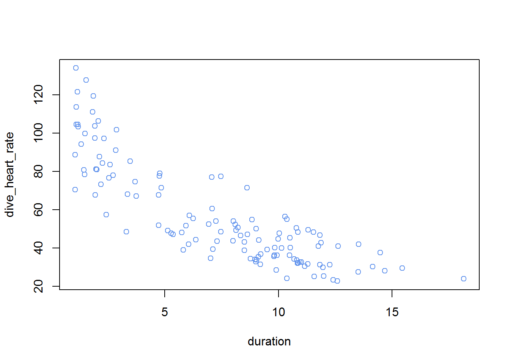{width=672}
:::
:::


Vi befinner oss i tredje kvadranten på Tukeys cirkel och föreslår följande två modeller

-   **Modell 1**: $\widehat{DHR^{1/2}} = b_0 + b_1duration$.

-   **Modell 2**: $\widehat{DHR^{1/2}} = b_0 + b_1duration^{1/2}$.

Vi anpassar Modell 1 och plottar de predikterade värdena tillsammans med data i originalskala som vi gjorde i Avsnitt 3. Skillnaden är att när vi predikterar på originalskala så använder vi en annan inverstransformation, $\left(\widehat{y^{1/2}}\right)^2$ enligt tabellen ovan.


::: {.cell}

```{.r .cell-code}
lm_sqrtDHR_vs_duration <- lm(sqrt(dive_heart_rate) ~ duration, data = penguins)
sqrty_hat <- predict(lm_sqrtDHR_vs_duration) # sqrt scale prediction
y_hat <- sqrty_hat^2 # original scale prediction
plot(dive_heart_rate ~ duration, data = penguins, col = "cornflowerblue", ylim = c(0, 140), main = "Model 1") # Data on original scale
lines(penguins$duration, y_hat, type = "p", col = "lightcoral")
legend(x = "topright", pch = c(1, 1), col = c("cornflowerblue", "lightcoral"), legend=c("Data", "Predicted"))
```

::: {.cell-output-display}
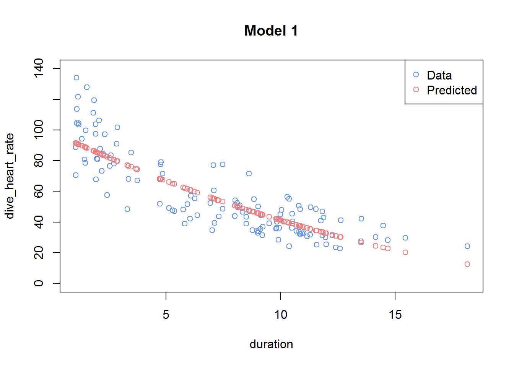{width=672}
:::
:::


::: {.callout-note icon="false"}
## Extra: Rita den anpassade kurvan

I Avsnitt 3 lärde vi oss (extra-rutan) hur man ritar in den anpassade kurvan. Vi kan göra samma sak för Modell 1.


::: {.cell}

```{.r .cell-code}
plot(dive_heart_rate ~ duration, data = penguins, col = "cornflowerblue", ylim = c(0, 140), main = "Model 1") # Data on original scale
x_min <- min(penguins$duration) # Min duration 
x_max <- max(penguins$duration) # Max duration
N <- 1000 # Number of grid points to predict
new_x <- data.frame(duration = seq(x_min, x_max, length.out = N)) # The grid in a dataframe
sqrty_hat_grid <- predict(lm_sqrtDHR_vs_duration, newdata = new_x)
yhat_grid <- sqrty_hat_grid^2 # Inverse transform
lines(penguins$duration, y_hat, type = "p", col = "lightcoral") # Prediction of data points
lines(new_x$duration, yhat_grid, type = "l", col = "lightcoral") # Prediction on grid
legend(x = "topright", pch = c(1, 1, NA), lty = c(NA, NA, 1), col = c("cornflowerblue", "lightcoral", "lightcoral"), legend=c("Data", "Predicted", "Fitted curve"))
```

::: {.cell-output-display}
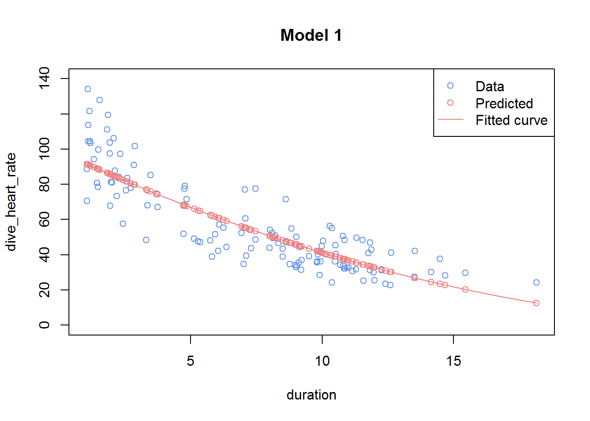{width=672}
:::
:::

:::

Vi anpassar Modell 2 med följande kod. Notera att Modell 2 också transformerar den förklarande variabeln. R håller reda på det åt oss om vi anger `I(sqrt(duration))` i formula-syntaxen och vi behöver inte göra något extra.


::: {.cell}

```{.r .cell-code}
lm_sqrtDHR_vs_sqrtduration <- lm(sqrt(dive_heart_rate) ~ I(sqrt(duration)), data = penguins)
sqrty_hat <- predict(lm_sqrtDHR_vs_sqrtduration) # sqrt scale prediction
y_hat <- sqrty_hat^2 # original scale prediction
plot(dive_heart_rate ~ duration, data = penguins, col = "cornflowerblue", ylim = c(0, 140), main ="Model 2") # Data on original scale
lines(penguins$duration, y_hat, type = "p", col = "lightcoral")
legend(x = "topright", pch = c(1, 1), col = c("cornflowerblue", "lightcoral"), legend=c("Data", "Predicted"))
```

::: {.cell-output-display}
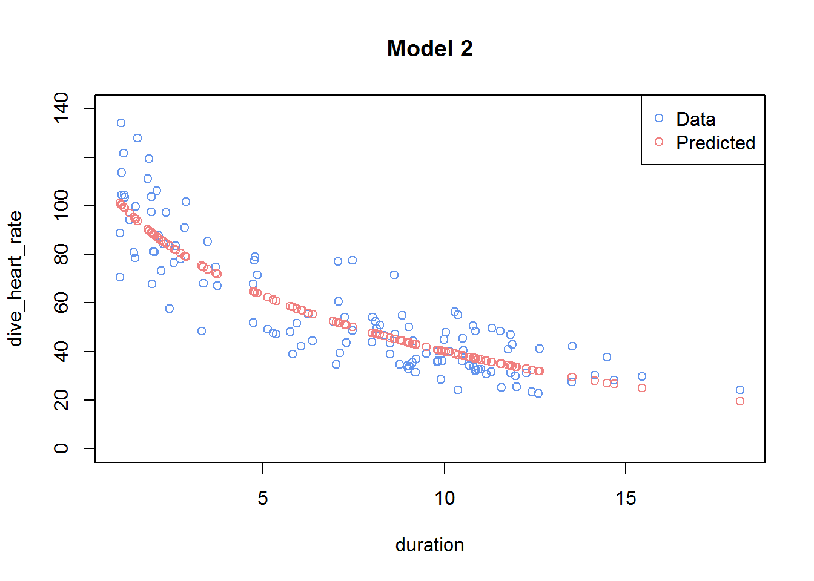{width=672}
:::
:::


::: {.callout-note icon="false"}
## Extra: Rita den anpassade kurvan

Kod som också ritar den anpassade kurvan för Modell 2.


::: {.cell}

```{.r .cell-code}
plot(dive_heart_rate ~ duration, data = penguins, col = "cornflowerblue", ylim = c(0, 140), main = "Model 2") # Data on original scale
x_min <- min(penguins$duration) # Min duration 
x_max <- max(penguins$duration) # Max duration
N <- 1000 # Number of grid points to predict
new_x <- data.frame(duration = seq(x_min, x_max, length.out = N)) # The grid in a dataframe
sqrty_hat_grid <- predict(lm_sqrtDHR_vs_sqrtduration, newdata = new_x)
yhat_grid <- sqrty_hat_grid^2 # Inverse transform
lines(penguins$duration, y_hat, type = "p", col = "lightcoral") # Prediction of data points
lines(new_x$duration, yhat_grid, type = "l", col = "lightcoral") # Prediction on grid
legend(x = "topright", pch = c(1, 1, NA), lty = c(NA, NA, 1), col = c("cornflowerblue", "lightcoral", "lightcoral"), legend=c("Data", "Predicted", "Fitted curve"))
```

::: {.cell-output-display}
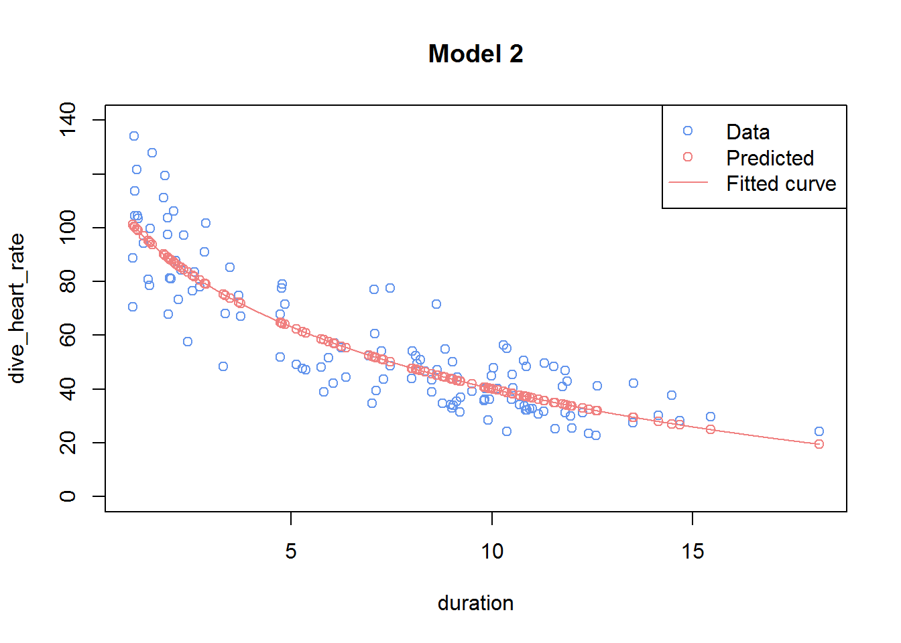{width=672}
:::
:::

:::

Vi ska nu välja vilken av Modell 1 eller Modell 2 är att föredra med hjälp av korsvalidering. På föreläsningen gick vi genom korsvalidering med $K = 4$ folds. Här har vi 125 pingviner som är jämnt delbart med 5, så vi använder $K = 5$ folds istället. Vi får då 80% träningsdata och 20% testdata för varje fold enligt figuren nedan.

{fig-align="center" width="500"}

För varje modell behöver vi anropa funktionen `lm()` $K=5$ gånger med olika träningsdata enligt uppdelningen ovan. Funktionen `lm()` har ett argument `subset` som bestämmer vilka observationer (pingviner) som ska användes för att anpassa modellen, dvs träningsdata. När `lm()` har anpassats till fold $k$ använder vi funktionen `predict()` för att prediktera testdatan för fold $k$ och räkna ut dess residualkvadratsumma (SSE, sum of squared errors). Koden nedan demonstrerar proceduren för första folden, dvs $k=1$, och förklaras lite mer detaljerad efter kodsnutten.


::: {.cell}

```{.r .cell-code}
n <- 125 # Number of observations
# Fold 1:
obs_index <- c(1:n) # Keeps track of the indices of  the dataset (1, 2, 3, ...., n = 125)
test_fold_index <- obs_index[c(1:25)] # Subsets indices 1:25 (test data fold 1) 
training_fold_index <- obs_index[-c(1:25)] # Takes out the complement
lm_modell1_fold1 <- lm(sqrt(dive_heart_rate) ~ duration, subset = training_fold_index, data = penguins) # Estimate fold 1
test_data <- penguins[test_fold_index, ] # Create test data for fold
sqrty_hat_fold1 <- predict(lm_modell1_fold1, newdata = test_data) # Predict test data in sqrt scale
y_hat_fold1 <- (sqrty_hat_fold1)^2 # Predict test data ordinary scale
SSE_fold1 <- sum((test_data$dive_heart_rate - y_hat_fold1)^2) 
```
:::


Notera att datasetet `penguins.RData` redan ligger i slumpmässig ordning och därför kan `obs_index` innehålla observationerna i stigande ordning. Ett exempel på ett dataset som ligger i ordning (dvs inte slumpmässigt ordning) är `FevChildren.RData` där barnen i den lägsta åldersgruppen kommer först, därefter mittersta åldersgruppen följt av äldsta åldersgruppen (ni kan se det genom att klicka på datasetet i Environment-fliken). För ett dataset som ligger i ordning kan man istället definiera `obs_index <- sample(c(1:n))`. Då innehåller `obs_index` indexen $1, 2, \dots, n$ i slumpmässig ordning.

#### 💪 Uppgift 5.1

Skriv ut `test_fold_index` och bekräfta att den innehåller indexen för testdata i fold 1, dvs de första 25 observationerna.


::: {.cell}

```{.r .cell-code}
# Write your code here
```
:::


När vi skapar `training_fold_index` ovan, notera att `-c(1:25)` skapar en vektor med värden $-1, -2, \dots, -25$. När vi skriver `obs_index[-c(1:25)]` försöker vi alltså plocka ut negativa index ur vektorn `obs_index`! Negativ indexering i R har en speciell betydelse: Ett negativt index hämtar ut alla andra observationer förutom den som har ett negerat index (negativt index). För att illustrera detta betrakta följande exempel:


::: {.cell}

```{.r .cell-code}
my_vector <- c(3, 2, 1, 20, 3)
my_vector[-4]
```

::: {.cell-output .cell-output-stdout}
```
[1] 3 2 1 3
```
:::

```{.r .cell-code}
my_vector[-2]
```

::: {.cell-output .cell-output-stdout}
```
[1]  3  1 20  3
```
:::

```{.r .cell-code}
my_vector[c(-1, -3)]
```

::: {.cell-output .cell-output-stdout}
```
[1]  2 20  3
```
:::
:::


`my_vector[-4]` hämtar ut alla observationer förutom den som är på index 4. `my_vector[-2]` hämtar ut alla observationer förutom den som är på index 2. `my_vector[c(-1, -3)]` hämtar ut alla observationer förutom de som är på index 1 och 3.

#### 💪 Uppgift 5.2

Vilka observationer hämtas ut om man skriver:

-   `my_vector[-1]`?

-   `my_vector[-c(3, 1)]`?

-   `my_vector[-c(1, 2, 4, 5)]`?

Fundera på svaret innan ni bekräftar med hjälp av kod.


::: {.cell}

```{.r .cell-code}
# Write your code here
```
:::


För att tydligt illustrera vad som händer, låt oss göra en figur som innehåller:

-   Träningsdata.

-   Testdata.

-   Modellens anpassning (baserat på träningsdata) som inkluderar prediktion av testdata.


::: {.cell}

```{.r .cell-code}
plot(dive_heart_rate ~ duration, subset = training_fold_index,  data = penguins, col = "cornflower blue", ylim = c(0, 140), main = "Crossvalidation Model 1: Fold 1 results") # Training data
lines(penguins$duration[test_fold_index], penguins$dive_heart_rate[test_fold_index], type = "p", col = "lightgreen") # Test data
x_min <- min(penguins$duration) # Min duration 
x_max <- max(penguins$duration) # Max duration
N <- 1000 # Number of grid points to predict
new_x <- data.frame(duration = seq(x_min, x_max, length.out = N)) # The grid in a dataframe
sqrty_hat_grid_fold1 <- predict(lm_modell1_fold1, newdata = new_x)
yhat_grid_fold1 <- sqrty_hat_grid_fold1^2 # Inverse transform
lines(new_x$duration, yhat_grid_fold1, type = "l", col = "lightcoral") # Prediction on grid
legend(x = "topright", pch = c(1, 1, NA), lty = c(NA, NA, 1), col = c("cornflowerblue", "lightgreen", "lightcoral"), legend=c("Training data", "Test data", "Fitted curve"))
```

::: {.cell-output-display}
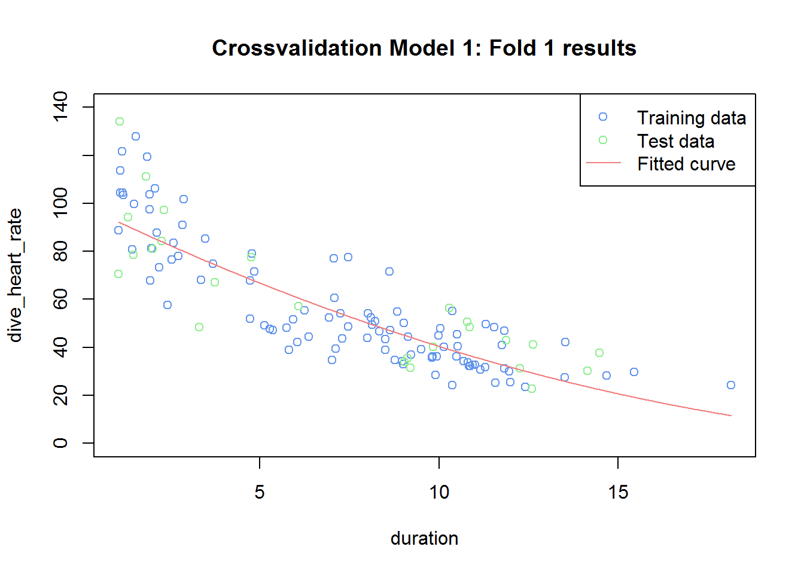{width=672}
:::
:::


Variabeln `yhat_grid_fold1` innehåller prediktionerna för testdata. En sådan prediktion ges av kurvans $y$-värde för en grön punkts (testdata) $x$-värde.

#### 💪 Uppgift 5.3

Identifiera testobservationen som har störst prediktionsfel i plotten ovan.

Ovan har vi grafiskt illustrerat hur korsvalideringsproceduren fungerar inom en given fold i pedagogiskt syfte. Normalt utför man korsvalidering utan en grafisk illustration. Följande kod utför korsvalideringen för fold 2, 3, 4. Den sista folden (fold 5) lämnas som en uppgift (se nedan).


::: {.cell}

```{.r .cell-code}
# Fold 2:
test_fold_index <- obs_index[c(26:50)] # Subsets indices 26:50 (test data fold 2) 
training_fold_index <- obs_index[-c(26:50)] # Takes out the complement
lm_modell1_fold2 <- lm(sqrt(dive_heart_rate) ~ duration, subset = training_fold_index, data = penguins) # Estimate fold 2
test_data <- penguins[test_fold_index, ] # Create test data for fold
sqrty_hat_fold2 <- predict(lm_modell1_fold2, newdata = test_data) # Predict test data in sqrt scale
y_hat_fold2 <- (sqrty_hat_fold2)^2 # Predict test data ordinary scale
SSE_fold2 <- sum((test_data$dive_heart_rate - y_hat_fold2)^2)

# Fold 3:
test_fold_index <- obs_index[c(51:75)] # Subsets indices 51:75 (test data fold 3) 
training_fold_index <- obs_index[-c(51:75)] # Takes out the complement
lm_modell1_fold3 <- lm(sqrt(dive_heart_rate) ~ duration, subset = training_fold_index, data = penguins) # Estimate fold 3
test_data <- penguins[test_fold_index, ] # Create test data for fold
sqrty_hat_fold3 <- predict(lm_modell1_fold3, newdata = test_data) # Predict test data in sqrt scale
y_hat_fold3 <- (sqrty_hat_fold3)^2 # Predict test data ordinary scale
SSE_fold3 <- sum((test_data$dive_heart_rate - y_hat_fold3)^2)

# Fold 4:
test_fold_index <- obs_index[c(76:100)] # Subsets indices 76:100 (test data fold 4) 
training_fold_index <- obs_index[-c(76:100)] # Takes out the complement
lm_modell1_fold4 <- lm(sqrt(dive_heart_rate) ~ duration, subset = training_fold_index, data = penguins) # Estimate fold 4
test_data <- penguins[test_fold_index, ] # Create test data for fold
sqrty_hat_fold4 <- predict(lm_modell1_fold4, newdata = test_data) # Predict test data in sqrt scale
y_hat_fold4 <- (sqrty_hat_fold4)^2 # Predict test data ordinary scale
SSE_fold4 <- sum((test_data$dive_heart_rate - y_hat_fold4)^2)
```
:::


#### 💪 Uppgift 5.4

Utför de beräkningar som krävs att räkna ut SSE för fold 5.


::: {.cell}

```{.r .cell-code}
# Write your code here.
```
:::


Den korsvaliderade root mean squared error (RMSE) ges av $$\mathrm{RMSE}_{\mathrm{cv}} = \sqrt{\frac{1}{n} \sum_{k=1}^K \mathrm{SSE}_k},$$ där $K=5$, $n=125$ (totala antalet observationer) och $\mathrm{SSE}_k$ är SSE för fold $k$.

#### 💪 Uppgift 5.5

Beräkna $\mathrm{RMSE}_{\mathrm{cv}}$ för Modell 1.


::: {.cell}

```{.r .cell-code}
# Write your code here.
```
:::


#### 💪 Uppgift 5.6

Utför korsvalidering för Modell 2 och beräkna dess $\mathrm{RMSE}_{\mathrm{cv}}$. Vilken modell är bäst?


::: {.cell}

```{.r .cell-code}
# Write your code here.
```
:::


## 6. Sammanfattning {#sammanfattning}

::: callout-info
## I den här laborationen har du lärt dig:

-   Korrelation för att beskriva ett linjärt samband mellan två numeriska variabler.

-   Hur man tolkar en enkel och multipel linjär regression.

-   Hur man använder R för att anpassa linjära och icke-linjära regressionsmodeller.

-   Hur man använder R för att prediktera linjära och icke-linjära regressionsmodeller.

-   Hur man validerar en modell via en residualanalys.

-   Hur man väljer modeller med hjälp av korsvalidering.
:::

## A. Appendix

Lista över några vanliga argument i grafer

-   col = färg, kan markeras med siffror eller med namnet på färgen, oftast med små bokstäver. Glöm ej att texten måste ligga inom citattecken.

-   main = rubrik på plotten, detta sätts till en textsträng, alltså en text inom citattecken.

-   xlab = rubrik på x-axeln, detta sätts till en textsträng, alltså en text inom citattecken.

-   ylab = rubrik på y-axeln, detta sätts till en textsträng, alltså en text inom citattecken.

-   xlim = definitionsområde för x-axeln. Exempelvis betyder xlim = c(0, 14.3) att det lägsta värdet som ritas kommer att vara 0 och det högsta värdet kommer att vara 14.3 (på x-axeln).

-   ylim = definitionsområde för y-axeln. Exempelvis betyder ylim = c(-2, 20.7) att det lägsta värdet som ritas kommer att vara -2 och det högsta värdet kommer att vara 20.7 (på y-axeln).

-   lwd = tjocklecken på linjer (eller prickar) i ett linjediagram (spridningsdiagram), anges med ett nummer.

-   lty = typ av linje (rak, streckad, prickad etc) i ett linjediagram, anges med ett nummer.

-   pch = typ av prick (rund, fyrkantig + \* etc), sätts till ett nummer.

-   breaks = antal staplar i ett histogram.

-   cex = justering av etiketternas storlek i en figur (exempelvis cex = 0.5 i en `legend()` funktion minskar storleken som "legend-texten" tar upp i en figur med hälften). Finns även exempelvis cex.axis, cex.main för att justera storleken av texter på axlar respektive rubrik.

-   bg = bakgrundsfärg i en figur.

-   col.main = rubrikens färg.

-   col.lab = färger för rubrikerna på axlarna.

-   font = specificerar vilken typ av text man vill ha, exempelvis ger font = 3 kursiv text.

