## Översikt

-   Tre sorters sannolikheter

-   Något mer

-   Något ännu mer

## Utfallsrum

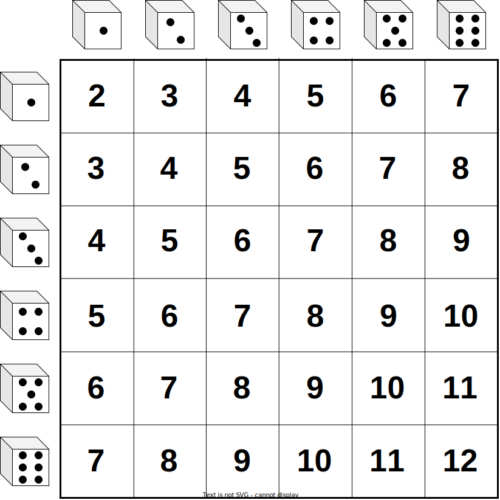{fig-align="center" width="350"}

## Händelse

-   Händelsen A = få exakt 7 prickar med två tärningar. $$
    A = \{(1,6), (2,5),(3,4),(4,3),(5,2),(6,1)\}
    $$

-   En händelse är en [**mängd**]{style="color:#ff8000"} av elementärhändelser.

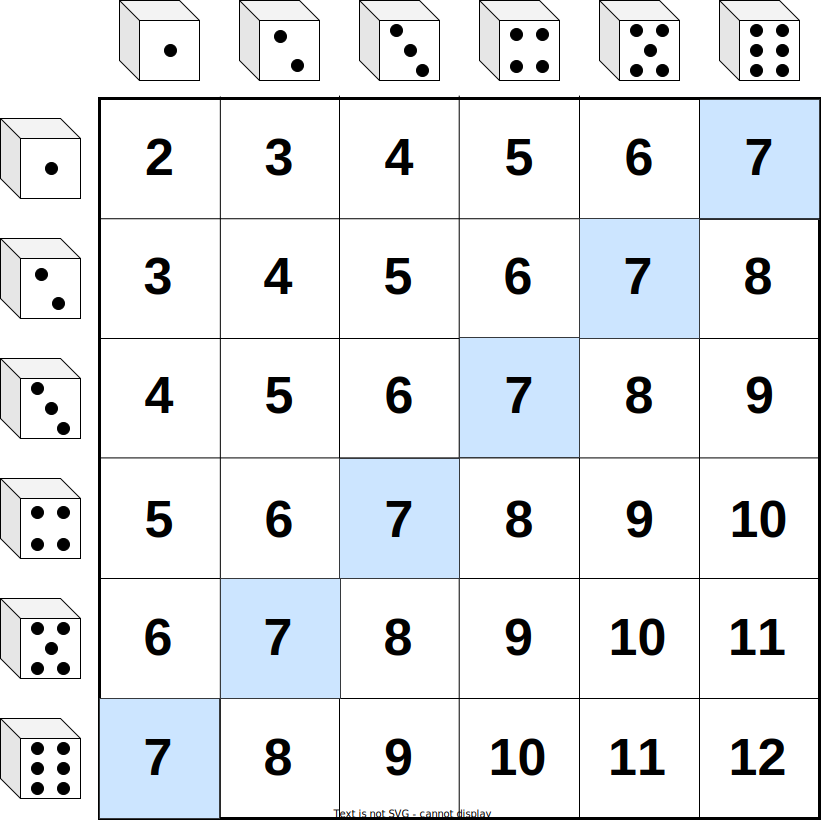{fig-align="center" width="400"}

## Händelse

-   Händelsen A = få samma antal prickar på båda tärningarna. $$
    A = \{(1,1), (2,2),(3,3),(4,4),(5,5),(6,6)\}
    $$

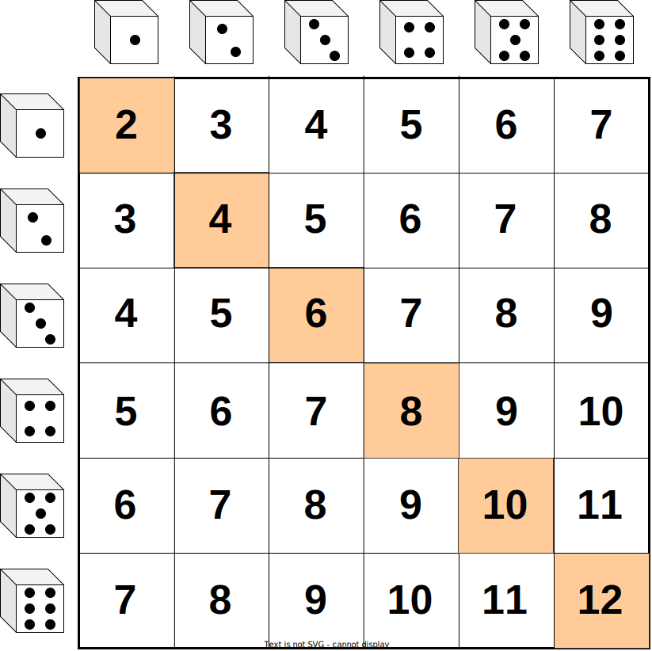{fig-align="center" width="400"}

## Händelse

-   Händelsen A = få exakt 7 prickar med två tärningar. $$
    A = \{(1,6), (2,5),(3,4),(4,3),(5,2),(6,1)\}
    $$

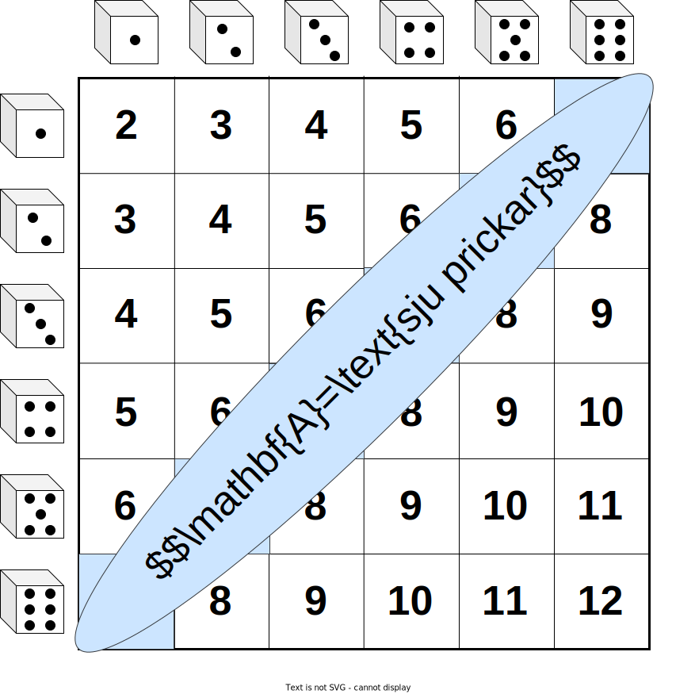{fig-align="center" width="400"}

## Händelse - Venn diagram

-   Praktiskt att visualisera händelser i ett Venn diagram.
-   Utfallsrummet (allt som kan inträffa) kan visas med en rektangel.
-   Händelser ritas som cirklar, ellipser eller rektanglar.

::: r-stack
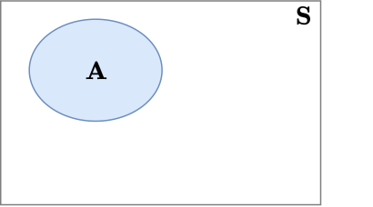{fig-align="center" width="350"}

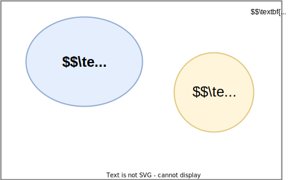{.fragment fig-align="center" width="350"}

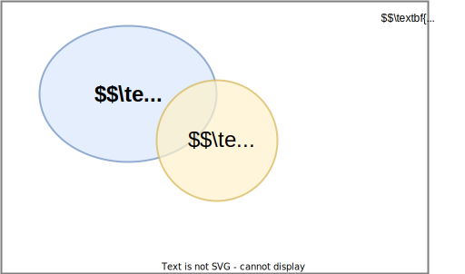{.fragment fig-align="center" width="350"}
:::

## Komplementhändelsen

::: columns
::: {.column width="70%"}
-   [**Komplementet**]{style="color:#ff8000"} till A inträffar när [**A inte inträffar**]{style="color:#ff8000"}.  
-   Vi skriver $\mathbf{A}^c$ där $c$ står för engelskans [c]{style="color:#ff8000"}omplement.
:::

::: {.column width="30%"}
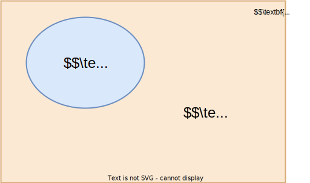{fig-align="center" width="500"}
:::
:::

::: columns
::: {.column width="70%"}
::: {.callout-note icon="false"}
## Exempel - Tärning 

$\mathbf{A}$ = {udda antal prickar på tärning} = {1,3,5}.

$\mathbf{A}^c$ = {jämnt antal prickar på tärning} = {2,4,6}.
:::
:::

::: {.column width="30%"}
&nbsp;

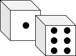{fig-align="center" width="120"}
:::
:::

::: columns
::: {.column width="70%"}
::: {.callout-note icon="false"}
## Exempel - Inflation

$\mathbf{A}$ = {inflationen nästa månad $\leq 2$}.

$\mathbf{A}^c$ = {inflationen nästa månad $> 2$}.
:::
:::

::: {.column width="30%"}
&nbsp;
:::
:::

::: columns
::: {.column width="70%"}
::: {.callout-note icon="false"}
## Exempel - Mjukvarubuggar

$\mathbf{A}$ = {åtminstone en bugg i programvaran}={1 bugg, 2 buggar, ...}.

$\mathbf{A}^c$ = {ingen bugg i programvaran}
:::
:::

::: {.column width="30%"}
&nbsp;

{fig-align="center" width="100"}
:::
:::

## Disjunkta händelser

-   [**Disjunkta**]{style="color:#ff8000"} händelser har inga gemensamma element.
-   Disjunkta händelser [**överlappar inte**]{style="color:#ff8000"} i Venn diagrammet.

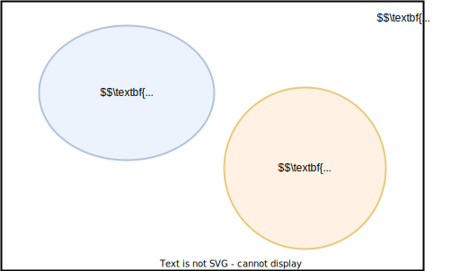{fig-align="center" width="300"}

::: aside
[🇺🇸 **Disjunkt = Disjoint**]{style="color:#ff8000"}
:::

## Snitthändelsen

-   [**Snittet**]{style="color:#ff8000"} av två händelser A och B är händelsen där [både]{style="color:#ff8000"} A och B inträffar.

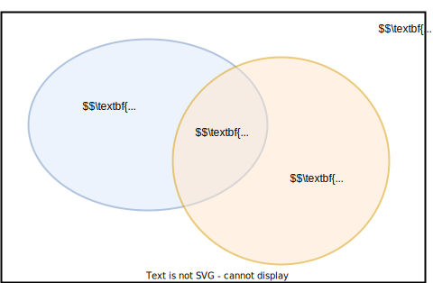{fig-align="center" width="300"}

-   `SDM` skriver $$P(\mathbf{A}\, and \, \mathbf{B})$$
-   Symbolen $\cap$ är också vanlig för snittet: $$P(\mathbf{A} \cap \mathbf{B})$$

::: aside
[🇺🇸 **Snitt = Intersection**]{style="color:#ff8000"}
:::
