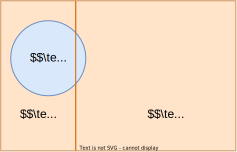
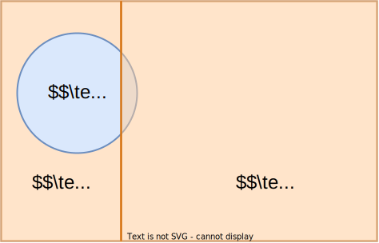
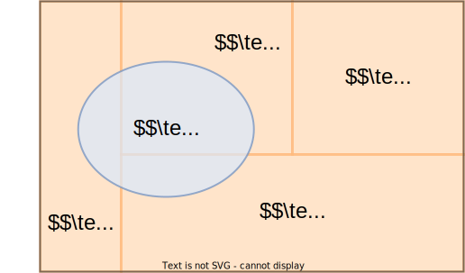
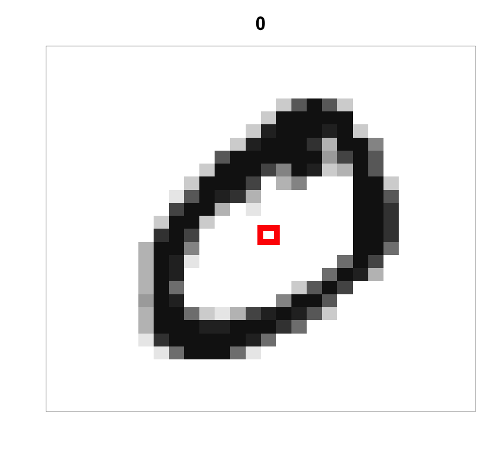
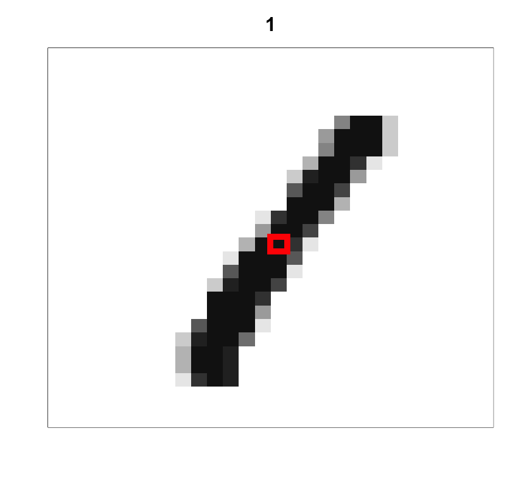

## Översikt

-   Betingade sannolikheter

-   Bayes sats

## Bayes sats

{fig-align="center" width="350"}

-   `Exempel` - Covid. B = Covid. A = test positivt.

## Bayes sats

{fig-align="center" width="350"}

$$
    P(B | A) = \frac{P(A \cap B)}{P(A)}
$$

$$
    P(B | A) = \frac{P(A | B)P(B)}{P(A)}
$$

## Bayes sats över en partition

::: columns
::: {.column width="60%"}
$$
    P(B_k | A) = \frac{P(A | B_k)P(B_k)}{P(A)}
$$

$$
    P(A) = \sum_{j=1}^K P(A | B_j)p(B_j)
$$

$$
    \color{#2679b5}{\boxed{P(B_k | A) = \frac{P(A | B_k)P(B_k)}{\sum_{j=1}^K P(A | B_j)p(B_j)}}}
$$
:::

::: {.column width="40%"}
{fig-align="center" width="350"}
:::
:::

::: columns
::: {.column width="60%"}
-   `Exempel` - Känna igen handskrivna siffor:
    -   $A =$ {svart pixel i mitten}
    -   $B_0=$ {siffran är en nolla}
    -   $B_1=$ {siffran är en etta}
    -   $B_2=$ {siffran är en tvåa} osv
:::

::: {.column width="40%"}
{fig-align="center" width="200"}{fig-align="center" width="200"}
:::
:::
