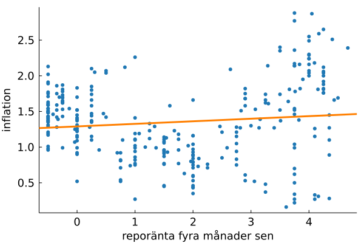

## Översikt

-   Motiverande exempel

-   Något mer

-   Något ännu mer

## Riksbanken och styrräntan

-   Riksbankens mål är att hålla inflationen nära 2% per år.

-   Standardfel och hypotestest måste korrigeras om laggar av $y_t$ fdfd ff

-   Hur beror inflationen på räntan?

-   Riksbankens mål är att hålla inflationen nära 2% per år.

::: {layout="[ [1,1]]"}
{fig-align="center" width="300"}

{fig-align="center" width="300"}
:::

$$
y_{t}=\alpha+{\color{orange} {\phi_{1}y_{t-1}}}+\varepsilon_{t}+{\color{blue} {\theta_{1}\varepsilon_{t-1}}}
$$

## Stuff

::: aside
Some additional commentary of more peripheral interest.
:::

-   Green [^1]
-   Brown
-   This is [**standard blue**]{style="color:blue"} text
-   This is [**my alternate blue**]{style="color:#2679b5"} text
-   This is [**my alternate orange**]{style="color:#ff8000"} text

[^1]: A footnote

## Tabs

::: panel-tabset
### Tab A

Content for `Tab A`

### Tab B

Content for `Tab B`
:::

## Interactive

```{ojs}
//| echo: false
data = FileAttachment("palmer-penguins.csv").csv({ typed: true })
```

```{ojs}
//| echo: false
viewof bill_length_min = Inputs.range(
  [32, 50], 
  {value: 35, step: 1, label: "Bill length (min):"}
)
viewof islands = Inputs.checkbox(
  ["Torgersen", "Biscoe", "Dream"], 
  { value: ["Torgersen", "Biscoe"], 
    label: "Islands:"
  }
)
```

```{ojs}
//| echo: false
filtered = data.filter(function(penguin) {
  return bill_length_min < penguin.bill_length_mm &&
         islands.includes(penguin.island);
})
```

::: panel-tabset
## Plot

```{ojs}
//| echo: false
Plot.rectY(filtered, 
  Plot.binX(
    {y: "count"}, 
    {x: "body_mass_g", fill: "species", thresholds: 20}
  ))
  .plot({
    facet: {
      data: filtered,
      x: "sex",
      y: "species",
      marginRight: 80
    },
    marks: [
      Plot.frame(),
    ]
  }
)
```

## Data

```{ojs}
//| echo: false
Inputs.table(filtered)
```
:::
