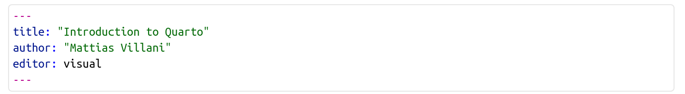
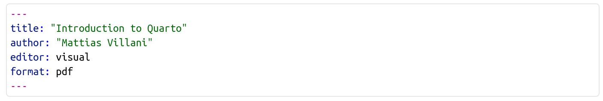
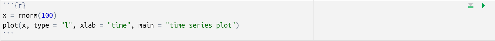
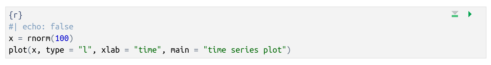
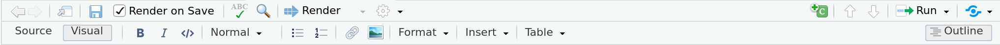

## 1. Introduction

Quarto is a way to integrated text (markdown), computer code, figures, tables and mathematical formulas in one document.\
Quarto documents (with file ending .qmd) can easily be turned into pdf format, html, website, blogs and presentations.

## 2. Setting for the document - the YAML

At the top of a quarto document is the so called YAML, which tells the Quarto engine how the document should be formatted. This is the YAML for this document:

{fig-align="center"}

which basically only gives the title and author information, everything else is using default settings. This will print (**render**) the document to html by default. If I instead wanted to render to pdf I would use the YAML:

{fig-align="center"}

## 3. Writing formatted text using markdown

The text written in a Quarto document can be formatted using the markdown language. Markdown is a very simple language for formatting text. For example, I can easily make the text **bold** by writing `**bold**` or *italic* using a single \* on each side of the text.

-   bullet

-   list

-   are also

-   easy

just put a `-` and space before each bullet point. Numbered lists are also simple, just place numbers and a dot (.) before each list item. Like this:

1.  This is the first point
2.  and this is second
3.  and so on.

Images can be inserted real easy by typing `{width="100"}` which would give the picture below.

{width="100"}

You can leave out the figure text and the width argument and just write: `` .

Tables are also pretty easy. The table below is made by writing

`| Name  | Age | Position            |`

`|-------|-----|---------------------|`

`| Mike  | 49  | Professor           |`

`| Sarah | 37  | Assistant professor |`

`| Anne  | 26  | PhD student         |`

| Name  | Age | Position            |
|-------|-----|---------------------|
| Mike  | 49  | Professor           |
| Sarah | 37  | Assistant professor |
| Anne  | 26  | PhD student         |

: A little table caption.

What if you want the table caption text to be above the tables, not below it like above? No sweat, just put `table-cap-location: top` in your YAML at the top of the document.

## 4. Writing code

Quarto document can have executable code in them. It supports several programming languages, most notably: R, Python and Julia. You just need to add a **code chunk**. A code chunk starts and ends with three so called backticks \`. This is a chunk of R code:

{fig-align="center"}

Note the little green Play-button. By pressing that we can run the code. After running the code in the Quarto-dokument, the variables (in this case a vector `x`) will be available in the console, just like for any R code. Here is the end result of that code chunk:

```{r}
x = rnorm(100)
plot(x, type = "l", xlab = "time", main = "time series plot")
```

What if I want to use the code to produce the plot, but not show the code in my report? Easy, I would just add some YAML information at the beginning of the code chunk itself. YAML inside of a code chunk must begin with the two characters `#|` . Here is how you hide the code:



The first character `#` is called a **hash** and the second `|` a **pipe**. So the recommended way to remember `#|` is by thinking of the Weezer song: [hash pipe](https://www.youtube.com/watch?v=fg_68MBzpzQ&ab_channel=Weezer-Topic). BTW, there I used a **hyperlink** which you write as `[link text](webpage address)` where the webpage address is a http-link, but can also be links within a document.

## 5. Writing mathematical formulas

Quarto supports LaTeX, which is a professional typesetting system for mathematical symbols. LaTeX takes a while to master, but you can look it up online to learn the basics. Just enclose LaTeX code between two dollar-signs on each side. Here is a simple example `$$\alpha_1$$` which would come out as $$\alpha_1$$ in your document. Here is a more complex example:

`$$\bar{x} = \frac{1}{n}\sum_{i=1}^n x_i$$`

which would come out as the formula for the sample mean:

$$\bar{x} = \frac{1}{n}\sum_{i=1}^n x_i$$

## 6. Using the Visual editor in RStudio

You can create ([**F**]{.underline}**ile**/**New [F]{.underline}ile**/[**Q**]{.underline}**uarto document...** menu) and write Quarto documents in RStudio. When you open a Quarto document in the editor the menu bar changes to (may look different for you):

{fig-align="center"}

Clicking on the `Render` button will render the document to html (default) or pdf (if you choose that in the YAML). Pressing the `Run` button will re-run all the code chunks in the document. You can write your Quarto document as markdown code if you click the `Source` -button in the extreme left. If you press the `Visual`-button you will see the document in a similar way to word processors like Word. You can then insert images and table, change font sizes etc by clicking on the menu. I tend to go spend most time in Visual mode, but will often go over to Source mode when I want absolute control of what I do.´

## 7. Going fancy - interactivity

Quarto documents have the basic interactivity that one can change code inside a code chunk, render the document and everything in the document changes according to the changes in the code.\
But it also possible to make the final html interactive. Below is an an example to wet your appetite. Try moving around the slides to change the plot. Note that you need to view the html file in an external web browser and not using the Viewer inside RStudio.

```{ojs}
//| echo: false
data = FileAttachment("palmer-penguins.csv").csv({ typed: true })
```

```{ojs}
//| echo: false
viewof bill_length_min = Inputs.range(
  [32, 50], 
  {value: 35, step: 1, label: "Bill length (min):"}
)
viewof islands = Inputs.checkbox(
  ["Torgersen", "Biscoe", "Dream"], 
  { value: ["Torgersen", "Biscoe"], 
    label: "Islands:"
  }
)
```

```{ojs}
//| echo: false
filtered = data.filter(function(penguin) {
  return bill_length_min < penguin.bill_length_mm &&
         islands.includes(penguin.island);
})
```

::: panel-tabset
## Plot

```{ojs}
//| echo: false
Plot.rectY(filtered, 
  Plot.binX(
    {y: "count"}, 
    {x: "body_mass_g", fill: "species", thresholds: 20}
  ))
  .plot({
    facet: {
      data: filtered,
      x: "sex",
      y: "species",
      marginRight: 80
    },
    marks: [
      Plot.frame(),
    ]
  }
)
```

## Data

```{ojs}
//| echo: false
Inputs.table(filtered)
```
:::
